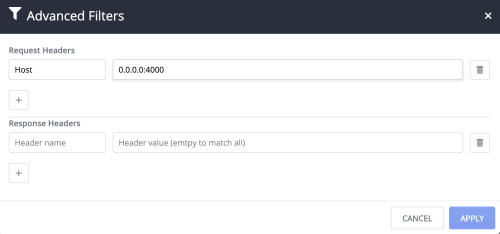
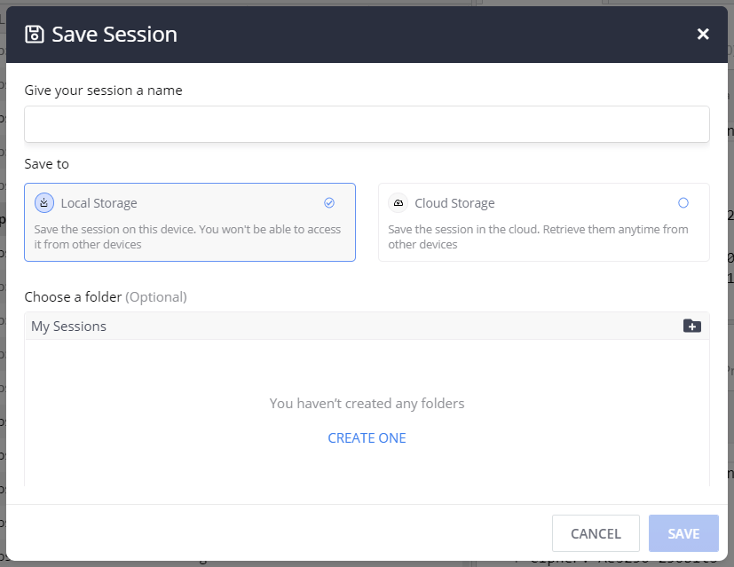
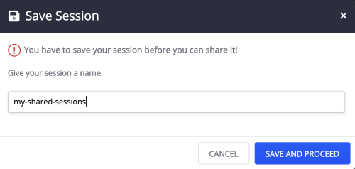
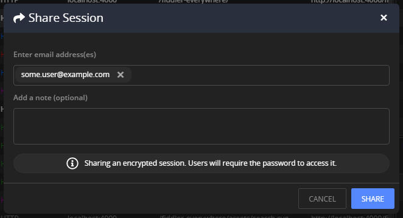

# Live Traffic Tab

The **Live Traffic** tab is an essential feature of Fiddler Everywhere. It displays a summary of each captured Session (in the [**Live Traffic list**](#live-traffic-list)). It provides functionalities to work with these sessions (through the [**Live Traffic toolbar**](#live-traffic-toolbar), the [**Inspectors**]() tabs, and the corresponding [**Rules tab**](). The section also enables sessions saving and sharing, editing issued requests, marking, commenting sessions, and applying rules.

>tip A **Session** (also mentioned as a **web session**) represents a single transaction between a client and a server, sometimes known as for request/response pair. Each Session appears as a single entry in the Live Traffic (refer to the images below). Each Session object has a **Request** and a **Response**, representing what the client sent to the server and what the server returned to the client. The Session object also maintains a set of Flags that record metadata about the session and a Timers object that stores timestamps logged during the Session processing.


## Live Traffic Toolbar

The Live Traffic toolbar provides various functionalities like streaming mode, decoding content, filtering by different criteria, saving, and sharing sessions.


To start capturing traffic, you need to enable **Live Traffic** by switching to **Capturing** mode. Use the off switch state to **pause** the traffic capturing (**Paused** mode).

The Live Traffic toolbar provides the following functionalities:

- [Stream](#stream)
- [Advanced Filters](#advanced-filters)
- [Clear All Filters](#clear-all-filters)
- [Save](#save)
- [Share](#share)
- [Remove All](#remove-all)
- [Search](#search)


### Stream

By default, Fiddler Everywhere uses **buffering mode**, which means that the responses are fully collected before any part is sent to the client. Buffering alters the responses (for example, an image won't begin to download until the containing page download is complete). With **streaming mode**, the server's responses are immediately returned to the client as it is downloaded. In streaming mode, tampering with the response body is not possible.

1. Click the **Stream** button to toggle between the streaming and buffering modes.

    Streaming mode is useful for low-level network timing scenarios (for example, by design, some browsers will parse partially downloaded HTML. That will start downloading external resources in parallel before the remote server has finished delivering the content).

    

    Streaming mode is also useful Ifs where a site delivers audio or video streams. These kinds of never-ending streams can't be buffered by Fiddler Everywhere.

### Advanced Filters

Use the **Advanced Filters** to apply filters based on the Request and Response headers. Only sessions that are covering the filter criteria will appear in the Live Traffic list.

1. Click the filter button to open the advanced filters popup windows.

2. The **Advanced Filters** window allows you to set specific criteria that will filter the captured traffic. Set the filter rules and click **Apply**.

    

Currently, the **Advanced Filters** entries are using **AND** logical operator. Each value is complying with the **EXACT** match.

>tip Alternatively, you can apply filters through the _more_ option on each Live Traffic column (for example, apply a filter for the _Host_ column). The column filtering allows using AND and OR logical operators (for two lines), and multiple comparison rules (for example, like **Is equal to**, **contains**, **ends with**, etc.).

### Clear All Filters

Use the **Clear All Filters** to reset all filters applied by **Advanced Filters** and filters applied for each column (see [the columns section](#-live-traffic-columns))


### Save

Use the **Save** button to save sessions for later use or prepare sessions for sharing.

1. Click the **Save** button.

2. A **Save Sessions** prompt window appears. Enter a valid name and click **Save**.

    

3. The current entry (of sessions) appears in the **Sessions** list.

>important The **Save** button will automatically save all captured traffic. If you want to keep only specific Sessions, you can select the wanted Sessions and use [the context menu](#save) for advanced save options.

### Share

Sharing sessions dramatically improves collaboration, and Fiddler Everywhere provides several options to export and share sessions:

- Sharing through the **Share** button from a saved Session entry in [the **Sessions** list](#sharing-sessions)).
- Sharing through the **Share** option from [the **Live Traffic** list context menu](#share).
- Sharing through the **Share** button from the **Live Traffic** list toolbar (see details below).

The toolbar comes with a **Share** button that will save the currently displayed sessions (captured from **Live Traffic**) in a file and then shares them through email (provided explicitly).

1. Click the **Share** button.

2. The **Save Session** prompt window appears. You need to save the sessions before they can be shared.

    

3. The **Share Sessions** prompt window appears. Enter a valid email (mandatory) and notes (optional) and click on the **Share** button.

    


### Remove All

Use the **Remove All** button to remove **all** captured traffic from the **Live Traffic** list. To remove specifically selected Sessions, use the [context menu](#remove)


### Search

Use the **Search** text input to search for specific values in the URL and the Headers of all Sessions. The search action will immediately filter and show all Sessions that are containing the search term.


## Live Traffic List

The Live Traffic list is an essential feature of Fiddler Everywhere - it displays a list of web sessions with a summary of each Session that the Fiddler Everywhere client has captured.


Many operations begin by selecting one or more entries in the Live Traffic and then activating other features.
- To select more than one Session, hold the **Ctrl** (**Command** on Mac) or **Shift** keys while clicking on the desired rows.
- Double-click or press **Enter** (**Return** on Mac) to activate the default inspectors for a single selected Session.

When the Inspectors are activated, they will automatically decide which Inspector is best suited to display the selected session's request and response.


### Live Traffic List Icons

The **Live Traffic List** uses the icons listed below to provide additional context for each recorded session. Hover on an icon on an entry in the Live Traffic list to trigger an explanatory tooltip.


-  - Represents a generic successful response.
-  - Uploading content for a session in progress (the request is being sent to the server).
-  - Uploading paused for session in progress.
-  - Downloading content for session in progress (the response is being read from the server).
-  - Downloading paused for session in progress.
-  - The session was aborted by the client, Fiddler, or the Server.
-  - The response was a server error.
-  - The response returned status code 401 Unauthorized.
-  - The response redirect status code 300, 301, 302, 303 or 307.
-  - A tunnel is used for WebSocket traffic.
-  - The request used the **HTTP CONNECT** method - establishes a tunnel used for HTTPS traffic.
-  - A tunnel used for RPC traffic.
-  - No content loaded.
-  - Not modified.
-  - Partial content.
-  - The response was an image.
-  - The response was a JavaScript file.
-  - The response was a CSS file.
-  - The response was an HTML file.
-  - The response was a Flash file.
-  - The response was an XML file.
-  - The response was a Silverlight file.
-  - The response was an audio file.
-  - The response was a video file.
-  - The response was a font file.
-  - The response was a JSON file.
-  - The request used the POST method.


## Live Traffic Columns

Certain key information is displayed in the columns of Live Traffic, including:

- **\#** - A unique identification number generated by Fiddler Everywhere.
- **Result** - The HTTP response [status code](https://developer.mozilla.org/en-US/docs/Web/HTTP/Status).
- **Protocol** - The protocol type (HTTP or HTTPS) used by the session.
- **Host** - The hostname and the port of the Server to which the request was sent. The column also indicates requests with **CONNECT** method with **Tunnel to** value (learn more about [CONNECT tunnels in Fiddler](https://textslashplain.com/2015/11/19/understanding-connect-tunnels/)).
- **Path** - The path refers to the exact location of a page, post, file, or another asset. The path resides after the hostname and is separated by “/” (forward slash).
- **URL** - The URL contains the protocol, the hostname, the port and the path from the request.
- **Method** - The HTTP Method used by the made request (GET, POST, PUT, etc.).
- **Process** - The local OS process from which the traffic originated (for example _chrome:8212_ indicates a Google Chrome browser instance).
- **Client IP** - Indicates the client IP that sent this request. Mostly applicable when multiple computers on a network are pointed to a single Fiddler instance.
- **Remote IP** - Indicates the IP address of the server used for this request.
- **Body Size** - The number of bytes in the response body.
- **Caching** - Values from the Response's **Expires** and **Cache-Control** headers.
- **Content-Type** - The **Content-Type** header from the response.
- **Time** - Indicates when the Session was executed in **HH:MM:SS:ms** format.
- **Date** - Indicates the date when the Session was executed in **MM:DD:YYYY** format.
- **Duration** - Indicates the duration in milliseconds that took for the Session to complete.
- **Rules Modified** - Indicates if the Session is modified by active rules from the **Rules** tab.
- **Comments** A field for showing the custom comments added by you (or the author of a shared session).


## Sort and Filter Traffic

By default, the captured traffic is sorted in the order they appear during the traffic capturing (sort by the unique identification number column), and no active filters are applied. You can use the built-in [sorting](#sorting-options) and [filtering](#filtering-options) options to optimize the outcome.

### Sorting Options

Create a custom sorting order by clicking the desired column. For example, click the **URL** column to sort alphabetically based on the URL, or click the **Body Size** column to sort based on the bytes' session size. The default sorting order is based on the unique identification number (order of appearance).

### Filter Options

Each column comes with a **more** button (three vertical dots), which opens a popup with additional **Filter** and **Columns** submenus.

Use the **Filter** submenu to apply filters for the currently selected column only (for example, filter all the traffic by _host_ name or by a specific _status code_). Columns with active filters will have a blue filter indicator. You can clear active filters through the **Filter** popup (for the filtered column) or use the global [**Clear All Filters** button](#clear-all-filters).


Use the **Columns** submenu to select which column will be visible in the **Live Traffic** list. By default, all columns are visible. Refer to the [KB article "How to View Web Session Summary"]() for detailed information about each column type.


## Context Menu Options

The context menu for the Live Traffic exposes several actions that can be applied for a Session or multiple Sessions. To show the context menu, press right-click (Windows OS) or **Control** + mouse-click (macOS).


### Edit in Composer

The context menu option **Edit in Composer** loads the selected request in a new Composer window where it can be edited, saved (for later usage and sharing), and reissued.

### Save

The context menu option **Save** provides the means to save selected sessions. The saved sessions will appear in the **Sessions** (the list to the left of the Fiddler Everywhere interface) from where they can be re-opened later, exported, and shared.

- **Selected sessions** - Saves all chosen Sessions. Keyboard shortcut: **S**.
- **Unselected sessions** - Saves all unselected Sessions. Keyboard shortcut: **Shift** + **Cmd** + **S** (Mac)  **Shift** + **S** (Windows).
- **All Sessions** - Saves all captured traffic (Keyboard shortcut: **S**). Keyboard shortcut: **Cmd** + **S** (Mac)  **Ctrl** + **S** (Windows).

All three options will display a save prompt.

1. Select the Sessions, open the context menu, and click the **Save** option.
1. Enter your Session name and click **Save**
1. The saved sSssions are immediately loaded in the **Sessions** list.
1. Double-click the saved Session to load it in the **Live Traffic** list.

>tip Alternatively, you can save all captured traffic [through the **Save** button from the toolbar](#save)

### Share

The context menu option **Share** enables the sharing of sessions. Before any session is shared, it is saved as an entry in the **Sessions** list. Then the entry can be transmitte through email.

- **Selected sessions** - Saves and shares all selected sessions.
- **Unselected sessions** - Saves and shares all unselected sessions.
- **All Sessions** - Saves and shares all captured traffic.

All three options will initially display a save prompt and then a share prompt window.

1. Select the sessions, open the context menu,  and click the **Share** option.
1. The selected sessions are being saved. Enter your session name and click **Save and proceed**
1. The share screen prompt window appears. Enter valid email and optionally add notes. Once ready, click **Share**.

>tip Alternatively, you can share captured traffic [through the **Share** button from the toolbar](#share)


### Export

The context menu option **Export** allows you to export the captured trafic in different known formats (like SAZ, HTTPArchive, WCAT, MeddlerScript, cURLScript and others).

- **Selected sessions** - Saves and shares all selected sessions.
- **Unselected sessions** - Saves and shares all unselected sessions.
- **All Sessions** - Saves and shares all captured traffic.


### Remove

Use the **Remove** context menu options to delete sessions from your **Live Traffic** list.

- **Selected sessions** - Removes all selected sessions. Keyboard shortcut: **Cmd** + **Back** (Mac), **Del** (Windows).
- **Unselected sessions** - Removes all unselected sessions. Keyboard shortcut: **Shift** + **Cmd** + **Back** (Mac), **Shift** + **Del** (Windows).
- **All Sessions** - Removes all captured traffic. Keyboard shortcut: **Cmd** + **X** (Mac), **Ctrl** + **X** (Windows).

### Comment

Use the **Comment** context menu option to add comments for the associated sessions.

1. Select the sessions, open the context menu, and click the **Comment** option - keyboard shortcut: **M**.
1. A **Comment** dialog appears. Enter the comment and click **Ok**.
1. The text is added to the comment field for the selected sessions.

### Mark

Use the **Mark** context menu option to apply different colors or to strikeout selected sessions.

1. Select the sessions, open the context menu, and click the **Mark** option.
1. Click the preferred marking style to apply it.

### Replay

Use the **Replay** context menu option to replay previously captured sessions - keyboard shortcut: **R**.

### Select

Use the **Select** context menu option to select sessions directly related to the currently selected session. The possibilities are to choose  **parent**, **children**, and **duplicate** sessions.

- **Parent request** Selects the session that is a parent of the currently selected session. Keyboard shortcut: **P**
- **Children requests** Select the sessions that are children of the currently selected session. Keyboard shortcut: **C**
- **Duplicate request** Selects the session that is duplicated to the currently selected session. Keyboard shortcut: **D**

### Copy

Use the **Copy** context menu option to place session information in the clipboard. The copied information options are:

- **URL** Provides the session URL. Keyboard shortcut:**Cmd** + **U** (Mac), **Ctrl** + **U** (Windows)
- **Full Summary** Provides verbose session details. Keyboard shortcut: **Cmd** + **C** (Mac), **Ctrl** + **C** (Windows)


_Example for copying URL_
```
http://0.0.0.0:4000/fiddler-everywhere/images/livetraffic/websessions/websessions-list-share-options.png
```

_Example for copying full info_
```
#   RESULT  PROTOCOL    HOST    URL METHOD  BODY    CACHING CONTENT-TYPE    PROCESS COMMENTS
277 200 HTTP    0.0.0.0:4000    /fiddler-everywhere/images/livetraffic/websessions/websessions-list-share-options.png   GET 207,094 private, max-age=0, proxy-revalidate, no-store, no-cache, must-revalidate   image/png; charset=utf-8        
```

### Add New Rule

You can use a captured session entry to mock some server behavior. For similar cases, the session URL can be used alongside the [Rules tab](). Creating rules allows you to test complex scenarios and various mock responses.

1. Select the desired session entry and make a right-click to open the context menu. From the context menu, select **Add New Rule**.

2. A new rule is automatically created. The rule will use the URL from the selected session entry and, by default, will apply the initial response through the **Return manually crafted response** action option.


## Additional Resources

- [Rules tab]()
- [Inspectors types]()
- [Composer tab]()
- [Modify traffic]()
- [Mock server response]()
