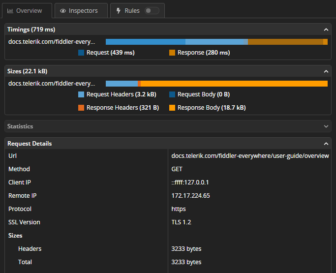

# Overview Tab

The **Overview** tab provides an easy way for the user to get structured information and different statistical data for one or more captured sessions. The tab is available for captured sessions in the [**Live Traffic** tab]() and all entries in the [**Sessions** list]().
The **Overview** tab has several widgets:

The **Overview** widgets are dynamically changing depending on the number of selected sessions.

- [Timings](#timings) - Available for both selection of a single session or selection of multiple sessions.
- [Sizes](#sizes) - Available for both selection of a single session or selection of multiple sessions.
- [Statistics](#statistics) - Available only when you select **multiple** sessions.
- [Request Details](#request-details) - Available only when you select a **single** session.
- [Response Details](#response-details) - Available only when you select a **single** session.

## Timings

The **Timings** widget provides a visual representation of the time needed to execute a single session or select multiple sessions. Each session is listed on a separate line and is presented with a URL (corresponds to the URL column in [the Live Traffic list](#live-traffic-list)) and a chart of the request and response timings.

The URL maximum length is 30 symbols. Use the three dots at the end of the wrapped URL to visualize a tooltip with the entire session URL. The timings chart splits into two main parts - the blue section of the chart shows timings related to the Request, and the orange section of the charts shows timings related to the Response. Each sub-chart area has a tooltip with descriptive information about the visualized timing.

**_Tracked Request Timings_**

- **Gateway Determination Time** - The time (in milliseconds) required to determine the gateway.
    **_Tip:_** All values over 1000ms are unusual and suggest an issue.

- **DNS Time** - The time (in milliseconds) required for a DNS lookup.
    **_Tip:_** Average DNS lookup times are between 20 and 120ms.

- **TCP Connect Time** - The time (in milliseconds) required to establish a TCP/IP connection.
    **_Tip:_** A value around 21000ms suggests that the target is unreachable, and the Windows OS took 21 seconds to confirm the issue.

- **HTTPS Handshake Time** - The time (in milliseconds) required to finish an HTTPS handshake.
    **_Tip:_** While capturing HTTPS traffic, Fiddler Everywhere acts as a man-in-the-middle, which means that you will see what the client and server are using to talk to Fiddler Everywhere. This can be different than what they’d use if the Fiddler Everywhere proxy were not in the middle. To see the CONNECT tunnels without the Fiddler Everywhere interference, you have to disable the [**Capture HTTPS traffic** option](#capture-https-traffic).

- **Client Connected** - The time (in milliseconds) between that and the previous event. The timestamp that indicates when the event happened is available in the [Request Details](#request-details) widget.

- **Client Begin Request** - The time (in milliseconds) between that and the previous event. The timestamp that indicates when the event happened is available in the [Request Details](#request-details) widget.

- **Fiddler Got Request Headers** - The time (in milliseconds) between that and the previous event. The timestamp that indicates when the event happened is available in the [Request Details](#request-details) widget.

- **Client Done Request** - The time (in milliseconds) between that and the previous event. The timestamp that indicates when the event happened is available in the [Request Details](#request-details) widget.

- **Server Connected** - The time (in milliseconds) between that and the previous event. The timestamp that indicates when the event happened is available in the [Request Details](#request-details) widget.

- **Fiddler Begin Request** - The time (in milliseconds) between that and the previous event. The timestamp that indicates when the event happened is available in the [Request Details](#request-details) widget.

- **Server Got Request** - The time (in milliseconds) between that and the previous event. The timestamp that indicates when the event happened is available in the [Request Details](#request-details) widget.

**_Tracked Response Timings_**

- **Server Begin Response** - The time (in milliseconds) between that and the previous response event. The timestamp that indicates when the event happened is available in the [Response Details](#response-details) widget.

- **Fiddler Got Response Headers** - The time (in milliseconds) between that and the previous response event. The timestamp that indicates when the event happened is available in the [Response Details](#response-details) widget.

- **Server Done Response** - The time (in milliseconds) between that and the previous response event. The timestamp that indicates when the event happened is available in the [Response Details](#response-details) widget.

- **Client Begin Response** - The time (in milliseconds) between that and the previous response event. The timestamp that indicates when the event happened is available in the [Response Details](#response-details) widget.

- **Client Done Response**  - The time (in milliseconds) between that and the previous response event. The timestamp that indicates when the event happened is available in the [Response Details](#response-details) widget.

Under the list of session lines, you will find two footers called ** Request** (light blue) and ** Response** (orange) with total timings in milliseconds (**ms**) or seconds (**s**)  for all listed sessions. So, for example, if five sessions are selected from the Live Traffic list, the displayed time in the **Request** and **Response** footers is the total time taken for all five selected requests/responses.

## Sizes

The **Sizes** widget provides a visual representation of the size of a single session or a selection of multiple sessions. Each session is listed on a separate line and is presented with a URL (corresponds to the URL column in [the Live Traffic list](#live-traffic-list)) and a chart that shows sizes of the headers and body of Request and Response, each included in a single chart.

The URL maximum length is 30 symbols. Use the three dots at the end of the wrapped URL to visualize a tooltip with the entire session URL.

**_Tracked session sizes_**

- **Request Headers** - The size of all request headers in bytes or kilobytes.

- **Request Body** - The size of all request bodies in bytes or kilobytes.

- **Response Headers** - The size of all response headers in bytes or kilobytes.

- **Response Body** - The size of all response bodies in bytes or kilobytes.

Below the list of session lines, you will find several footers called ** Request Headers** (dark blue), **Request Body** (light blue), **Response Headers** (red), and **Response Body** (orange) with the total size in kilobytes (**kB**) or bytes (**B**) for all listed sessions.

## Statistics

The **Statistics** widget contains a table with structured information for multiple selected sessions. The widget is only available when multiple sessions are selected (collapsed and inactive for a single session selection).

- **Session Count** - The number of selected sessions

- **Headers Sent** - The size of the sent request headers in bytes.

- **Body Sent** - The size of the sent request bodies in bytes.

- **Headers Received** - The size of the received response headers in bytes.

- **Body Received** - The size of the received response bodies in bytes.

- **Started At** - The date and time when the earliest client request is established. Corresponds to the **Client Begin Request** request timing.

- **Completed At** - The date and time when the latest client response finishes. Corresponds to the **Client Done Response** response timing.

- **Aggregate Duration** - The total aggregate duration for all selected sessions in milliseconds.

- **DNS Time** - The aggregate DNS time for all selected sessions in milliseconds.

- **Connect Time** - The aggregate TCP connect time for all selected sessions in milliseconds.

- **Handshake Time** - The aggregate HTTPS handshake time for all selected sessions in milliseconds.

- **Requests per Host** - A list of the hosts and the number of Requests to each of them.

- **Responses by Code** - A list of the received HTTP response status codes and the number of appearances.

- **Response Size by Type** - A list of the received response types and their aggregate size.

## Request Details

The Request Details widget contains a table with the following information.

- **URL** - The URL address of the selected session.

- **Method** - The HTTP request method

- **Client IP** - Indicates the client IP that sent this Request.
    **_Tip:_** Most of the time, the IP will show the loopback address (`0.0.0.0`), but it will be different if multiple computers on the network are pointed to a single Fiddler Everywhere instance.

- **Remote IP** - Indicates the IP address of the server used for this Request.

- **Protocol** - The protocol type (HTTP or HTTPS) used by the session.

- **SSL Version** - The version of the used cryptographic protocols (TSL or SSL).

- **Sizes**
    - **Body** - The size of the request body in bytes
    - **Headers** - The size of the request headers in bytes

- **Timings**  - a list (by execution order) with timestamps for each triggered request event

## Response Details

The Response Details widget contains a table with the following information:

- **Status** - The HTTP response status code and status message

- **Sizes**
    - **Body** - The size of the response body in bytes
    - **Headers** - The size of the response headers in bytes

- **Timings** - a list (by execution order) with timestamps or times (in milliseconds) for each triggered response event.
