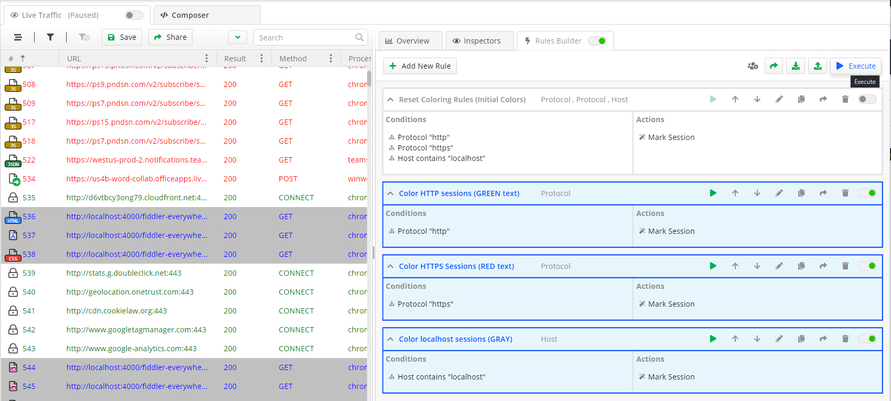
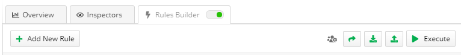
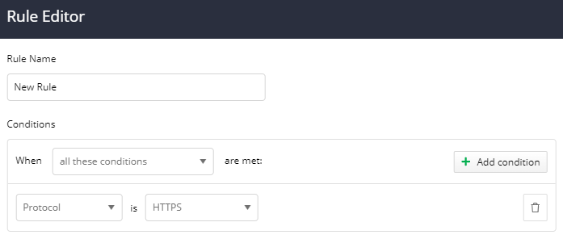

# Rules Builder Tab

The **Rules Builder** is one of the most powerful features of Fiddler Everywhere. It enables you to create __rules__ that will automatically trigger in response to requests. The functionality provides means to easily and quickly test changes to web code without updating the production server, reproducing previously captured bugs (in SAZ files), or running website demos while being entirely offline. The collaboration functionalities allow you to import and export s single rule or rulesets and share rules directly with other Fiddler Everywhere collaborators. Each rule has different order priority and execution weight which can be easily controlled by promoting or demoting a rule.



The **Rules Builder** tab contains the following sections:

- **Rules Builder Toolbar** - Provides means for sharing, manual import/export, and manual execution.
- **Rule Editor** - Use it to create new rules and edit existing ones.
- **Rules Queue** - A queue of created rules that are executed in the order of appearance (from the top one to the bottom one). Each rule in the queue has its toolbar with different rule-related functionalities.

## Rules Builder Rule of Thumbs

The following rules of thumb are essential to understand how the Rules Builder executes each rule depending on whether the session is actively captured (ongoing Live Traffic sessions) or running a rule on previously saved sessions.

_Live Traffic and Rules Builder basic guidelines_

  - The **Rules Builder** main toggle is available only for the **Live Traffic** section. 
  - The **Unmatched Requests Passthrough** is applicable only for ongoing capture via the **Live Traffic** section.
 -  If the **Rules Builder** toggle is ON, and a selected rule toggle is ON, that means the rule executes for all of the inbound/outbound captured traffic (**Live Traffic** section with enabled **Capturing**).
  - If the case the **Rules Builder** toggle is ON, and a selected rule toggle is OFF, that means that the rule won't execute for all of the inbound/outbound captured traffic (**Live Traffic** section with enabled **Capturing**).


_Save Sessions and Rules Builder basic guidelines_

 - The **Rules Builder** main toggle is not available for saved sessions (from the **Sessions** list).
 - The **Execute** from the primary **Rules Builder** toolbar will execute all currently selected rules. The result applies for all sessions that are matching the rule's conditions. If multiple rules are selected, they will be executed in the order of appearance in the **Rules Queue** - note that means that a rule can be overwritten by another rule that comes later in the queue. Some rules are also **final** (meaning that no other rules in the queue will be executed after a final rule).
 - The **Execute** button from a selected rule toolbar will only execute the currently selected rule.


>tip The **Rules Builder** is available with version 2.0.0 of Fiddler Everywhere, while older versions had the **Auto Responder**. The main difference lies in the capabilities of both functionalities. The Rules Builder can change what the servers will receive (in terms of requests and responses and given that such rules are applied). At the same time, the Auto Responder was only capable of mocking a server request/response and modifying the local request/response. It is essential to notice that not all rules are changing the server data.


## Rules Builder Toolbar

The main toolbar of the **Rules Builder** comes with the following functionalities:

- **Add New Rule** - Opens the **Rule Editor** window to create a new rule.
- **Shared Rules Builder Ruleset** - Opens a list of the shared rulesets.
- **Share** - Opens the _Share_ windows. Enter collaborator email to share with him all created rules.



## Rule Editor

The __Rules Editor__ interface enables creating and editing rules. For each new rule, you need to enter a **condition** (previosly known as **match rule**) and an **action** (previosly known as **action string**), and Fiddler Everywhere will undertake the action if the request URI matches the condition and if the rule is executed. 


### Add New Rule

1. Click on the **Add New Rule** button from the main toolbar.
1. Add new name for your rule in the **Rule Name** textfield.
1. Set the _When_ rule based on one of the following statements:
    - **all these conditions** - The rule will be applied only when all conditions are true (logical TRUE).
    - **any of these conditions** - The rule will be applied when any of the conditions is true (logical OR).
    - **none of these conditions** - The rule will be applied when none of the conditions is true (logical FALSE).
1. Add one or more conditions. See the [conditions section](#conditions) for more details.
1. Add one or more actions. See the [actions section](#actions) for more details.
1. Press **Save** to close the **Rule Editor** and add the newly created rule to the **Rules Queue**.

>Tips:
> - Rules are applied in the order that they appear in the **Rules Queue**. Use the **Down Arrow** to demote a rule and the **Up Arrow** to promote a rule in the queue.
> - You can export the current queue of rules [via the **Export** button](#export-rules) from the **Rules Queue** toolbar.
> - You can import a ***.FARX** file [via the **Import** button](#import-rules) to queue rules based on previously captured traffic.


### Conditions

The **Rule Editor** can add and use single or multiple conditions. The conditions are logical structures with different number of statements (from two to four statements - see the list below for details).


|Condition Value |Field Options |Field Options |Field Options |Usage Description                       |
|:--|:--|:--|:--|:--|
| Protocols  | HTTP, HTTPS  |n/a |n/a   |  Differentiate the traffic based on the used protocol (HTTP vs HTTPS) |
| Host | String modifyers  | search value  |n/a   | Search for a specific keyword in the **Host** column.   |
| Path | String modifyers  | search value |n/a   | Search for a specific keyword in the **Path** column.   |
| Url | String modifyers  | search value  |n/a   | Search for a specific keyword in the **URL** column.   |
| Status  |  Number modifyers (compares three-digit status codes) | search value  |   |   Search for a specific keyword in the **Result** column. |
| Url | String modifyers  | search value  |n/a   | Search for a specific keyword in the **URL** column.   |
| Method | String modifyers  | search value  |n/a   | Search for a specific keyword in the **Method** column.   |
| Process ID | String modifyers  | search value  |n/a   | Search for a specific keyword in the **Process** column.   |
| Client IP | String modifyers  | search value  |n/a   | Search for a specific keyword in the **Client IP** column.   |
| Remote IP | String modifyers  | search value  |n/a   | Search for a specific keyword in the **Remote IP** column.   |
| Body Size  |  Number modifyers (compares bytes) | search value  |   |   Search for a specific keyword in the **Body Size** column. |
| Duration  |  Number modifyers (compares milliseconds) | search value  |   |   Search for a specific keyword in the **Duration** column. |
| Comment | String modifyers  | search value  |n/a   | Search for a specific keyword in the **Comment** column.   |
| Request Body | String modifyers  | search value  |n/a   | Search for a specific keyword in the session request body.   |
| Request Headers |  header name | String modifyers  | search value  | Search for a specific keyword in the explicitly mentioned request header.   |
| Response Body | String modifyers  | search value  |n/a   | Search for a specific keyword in the session response body.   |
| Response Headers |  header name | String modifyers  | search value  | Search for a specific keyword in the explicitly mentioned response header.   |
| Cookie | the magic string | n/a | n/a  | n/a | A legacy filed for entering String literals as in the Fiddler Classic or the older versions of Fiddler Everywhere.   |





#### String Literals

Use string literals to create simple match conditions (case-insensitively). The asterisk char (__*__) can be used as a wildcard, while every other string literal will be checked for a match in the request URL. Below you will find some basic examples for matching conditions when using specific strings.

- Using asterisk char (__*__) will match everything.
```
www.example.com/Path1/query=example
www.example.com/SomethingCompletelyDifferent
```
- A basic string value (like __example__) will match all URLs that are containing the value (in this case __example__)
```
www.example.com/Path1/
www.something.com/Path1/query=example
```
- __path1/__ will match all URLs that are containing the path (in this case __path1/__)
```
www.example.com/path1/query=example
www.example.com/returnUrl=path1/OtherPlace
```
- __query__ will match all URLs that are containing the key or value keyword (in this case __query__)
```
www.example.com/Path1/q=Query
www.example.com/Path1/query=hello
```

#### NOT rules (for String Literals)

The __NOT:__ rule is applied only if the string does not match. Below you will find some basic examples for matching conditions when using specific strings.

- __NOT:EXAMPLE__ will match all URLs that do not contain the **EXAMPLE** string.
```
NOT:google.com

www.example.com/Path1/query=foo // (MATCH)
```

- __NOT:path1/__ will match all URLs that do not contain **path1/**.
```
NOT:path2/

www.example.com/path1/query=foo // (MATCH)
www.example.com/path2/query=foo // (No Match)
```

- __NOT:query__ wWill match all URLs that do not contain **query**.
```
NOT:query/

www.example.com/path1/query=foo // (No Match)
www.example.com/path2/somethingElse=foo // (MATCH)
```

#### EXACT Match

The __EXACT:__ is a case-sensitive match syntax for expressions and strings.

- __EXACT:URL__ - Will match URL that is identical to the passed **URL** parameter. Note that the __EXACT:__ rule is case-sensitive.
```
EXACT:www.example.com/Path1/query=foo

www.example.com/Path1/query=foo // (MATCH)
www.example.com/PATH1/query=foo // (No Match - mismatched case)
```

#### Regular Expressions

Fiddler Everywhere supports regular expressions syntax for expressions that begin with __regex:__. The regular expression will be used to replace the inbound URL with the string in the Actions row. Use __.+__ to match a sequence of one or more characters or __.*__ to match zero or more characters. Use __^__ at the front of your regex to mean "Start of the URL" and use __$__ at the tail of the regex to mean "End of the URL".

- __regex:.+__ will match all URLs
```
regex:.+

www.example.com/Path1/query=foo // (MATCH)
```

- __regex:.+.jpg$__ will match URLs that are ending with __.jpg__
```
regex:.+.jpg$

www.example.com/Path1/query=foo.jpg&bar // (MATCH)
www.example.com/Path1/query=example.jpg // (MATCH)
```

- __regex:.+.(jpg|gif|bmp)$__ will match URLs that are ending with the listed image extensions (case-sensitive!).
```HTML
regex:+.(jpg|gif|bmp)$

www.example.com/Path1/query=foo.jpg&bar // (No Match - improper ending)
www.example.com/Path1/query=exam ple.jpg // (MATCH)
www.example.com/Path1/query=foo.JPG // (No Match - mismatched case)
www.example.com/Path1/query=somegif.gif // (MATCH)
```

The standard regex implementation also allows using regex variables. An example of creating a redirect while using automatically created regex variables can be found in [this KB article](#redirect-with-regex).

### Actions

When Fiddler Everywhere identifies a request which matches the Rules Builder **Match** Rule, it automatically bypasses the server and maps it to the **ACTION** mentioned in the ruleset. Beyond simply returning files or predefined responses, the __Rules Builder__ can perform some specific actions:


| Action String     | Description | Action Type |
| :---- | :---- | :---- |
| __xxx.dat__      | Return response with HTTP status based on the content of the selected __xxx.dat__ file. Fiddler Everywhere provides [a predefined collection of different responses via the Actions drop-down menu](). | Final |
| __*exit__ | Stop processing rules at this point. | Final |
| __*drop__ | Close the client connection immediately without sending a response. | Final |
| __*reset__ | Reset the client connection immediately using a TCP/IP RST to the client. | Final |
| __*delay:###__ | Delay sending request to the server by __###__ of milliseconds. | Non-final |
| __*ReplyWithTunnel__ | Responds with an HTTP/200 tunnel for HTTPS traffic. Example: CONNECT method. | Final |
| __*CORSPreflightAllow__ | Returns a response that indicates that CORS is allowed. | Final |
| __*header:Name=Value__ | Set the Request header with the given __Name__ to the specified __Value__. If no header of that name exists, a new header will be created. | Non-final |
| __*redir:http://targetURL__ | Returns a HTTP Redirect to the target URL. Unlike the simple URL rule, this ensures that the client knows where its request is going so proper cookies are sent, etc. | Final |
| __http://targetURL__ | Returns the content of the __targetURL__ as the response. | Final |
| __Return manually crafted response__ | [Allows modifying the current response](#custom-http-response) (HTML, JS, JSON) previously returned by the server. | Final |
| __Choose saved response file...__ | The __Choose saved response file..…__ option in the Actions dropdown displays a file picker to allow you to select [a DAT file that contains modified HTTP response](#custom-dat-file).| Final |

__Rules with Non-final__ actions will allow the request to match multiple Rules Builder rules. As soon a rule specifying a final action is reached, the matching process exists, and no further rules are processed for that session.

## Rules Queue

The __Queue Viewer__ (a.k.a. __Queue Rules Viewer__) interface is a queue of the created Rules Builder rules. The __Queue Viewer__ allows the listed rules to be enabled and disabled, to be promoted and demoted (by changing their queue position), to be edited, to be exported and imported. The option to enable the __Rules Builder__ and to allow a non-matching request to pass-through is also part of the __Queue Viewer__.

### Rules Grouping & Priority

By default, the __Queue Viewer__ will list all created & imported rules based on their priority (see [Rule Options](#rule-options) for details on how to promote/demote a rule in the queue). You can also create a custom group for the rules in the queue by using __Group View/Priority View__ toggle button. 

Use __Group View/Priority View__ toggle to switch the rules in the queue based on priority vs. group identity.


Use __Group/Ungroup__ toggle button to create croups for selected rules in the queue. Note that the __Group/Ungroup__ button is visible only when you have toggled to __Group View__.


### Enable Auto Responses

Use the __Enable Auto Responses__ checkbox to activate the __Rules Builder__. Note that __Live Traffic__ switch should also be turned on to _Capturing_ mode.


### Import Rules

You can import rules from a __FARX__ (Fiddler Rules Builder XML) file. The __FARX__ file contains a set of previously created Rules Builder rules. Your current set of rules is automatically saved on exit and reloaded when you start Fiddler Everywhere again.

Use the __Import__ button to provide a FARX file that contains the set of rules.


### Export Rules

You can export rules in a FARX file (Fiddler Rules Builder XML). The exported file can be easily reused via the [import functionality](#import-rules).

Use the __Export__ button to create a FARX file that contains the set of rules.


### Unmatched Requests Passthrough

The __Unmatched Requests Passthrough__ option controls what happens when a Session does not match any of the applied rules. When the checkbox is checked, the unmatched requests are sent to the server normally, without any interference from the Rules Builder. When the option is OFF (the checkbox is unchecked), Fiddler will generate a __404__ Not Found response for any _unconditional_ requests that are not matching the applied rules.


>important By default, when the __Rules Builder__ is enabled, the __Unmatch Requests Passthrough__ option is turned off, meaning that all unmatched requests will start to fail with a __404 (Fiddled)__ response.

For example, Fiddler generated a 404 response due to a request that is not matching the applied rules when __Unmatch Requests Passthrough__ option is turned off.


### Rule Options

Each rule present in the __Queue Viewer__ can be controlled via the following options:


- __Enable & Disable Rule__ sets if the specified rule will be applied or not.

- __Promote__ raises the priority of the specified rule in the queue. If the rule has applied a final action, the lower priority rules won't be applied.

- __Demote__ lowers the priority of the specified rule in the queue.

- __Edit__ opens the specified rule in the [__Rules Editor__]() where it can be edited and saved.

- __Delete__ deletes the specified rule permanently.

## Rules Builder Settings
