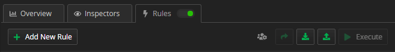
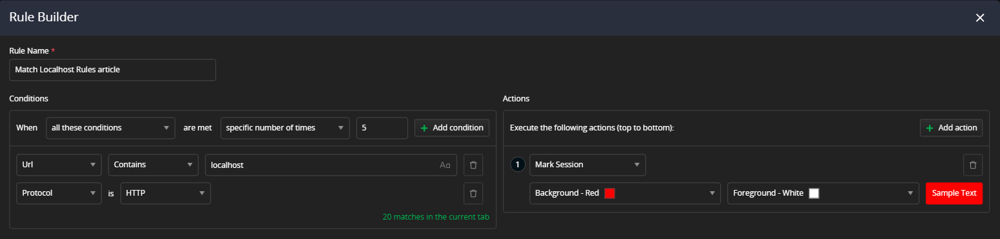
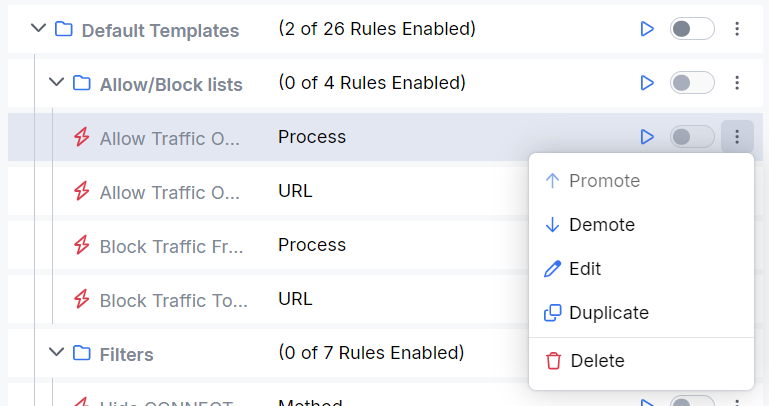
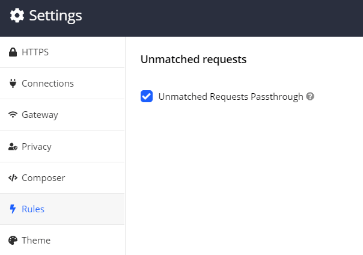
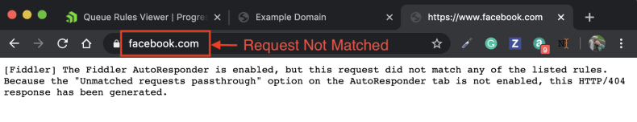

# Rules

The **Rules** tab is one of the most powerful features of Fiddler Everywhere. It enables you to create __rules__ that will automatically trigger in response to requests. The functionality provides means to easily and quickly test changes to web code without updating the production server, reproducing previously captured bugs (in SAZ files), or running website demos while being entirely offline. The collaboration functionalities allow you to import and export a single rule or rulesets and share rules directly with other Fiddler Everywhere collaborators. Each rule has different order priority and execution weight which can be easily controlled by promoting or demoting a rule.

The **Rules** tab contains the following sections:

- **Rules Toolbar** - Provides means for sharing, manual import/export, and manual execution.
- **Rule Builder** - Use this tool to create new rules and edit existing ones.
- **Rules Queue** - A queue of created rules that are executed in the order of appearance (from the top one to the bottom one). Each rule in the queue has its toolbar with different rule-related functionalities.

## Rule of Thumbs

The following rules of thumb are essential to understand how the Rules tab executes each rule depending on whether the session is actively captured (ongoing Live Traffic sessions) or running a rule on previously saved sessions.

_Live Traffic and Rules tab basic guidelines_

  - The **Rules** main toggle is available only for the **Live Traffic** section.
  - The **Unmatched Requests Passthrough** is applicable only for ongoing capture through the **Live Traffic** section.
 -  If the **Rules** toggle is ON, and a selected rule toggle is ON, that means the rule executes for all of the inbound/outbound captured traffic (**Live Traffic** section with enabled **Capturing**).
  - If the **Rules** toggle is ON, and a selected rule toggle is OFF, that means that the rule won't execute for all of the inbound/outbound captured traffic (**Live Traffic** section with enabled **Capturing**).

_Saved Sessions and Rules tab basic guidelines_

 - The **Rules** main toggle is not available for saved sessions (from the **Sessions** list). The toggle will be hidden when a saved session is loaded.
 - The **Execute** from the primary **Rules** toolbar will execute all currently selected rules. The result applies for all sessions that are matching the rule's conditions. If multiple rules are selected, they will be executed in the order of appearance in the **Rules Queue** - note that means that a rule can be overwritten by another rule that comes later in the queue. Some rules are also **final** (meaning that no other rules in the queue will be executed after a final rule).
 - The **Execute** button from a selected rule toolbar will only execute the currently selected rule.

>tip The **Rules** tab is available with version 2.0.0 of Fiddler Everywhere, while older versions had the **Auto Responder** tab. The main difference lies in the capabilities of both functionalities. The Rule Builder can change what the servers will receive (in terms of requests and responses and given that such rules are applied). At the same time, the Auto Responder was only capable of mocking a server request/response and modifying the local request/response. Therefore, it is essential to notice that not all rules are changing the server data.

## Rules Toolbar

The main toolbar of the **Rules** comes with the following functionalities:

- **Add New Rule** - Opens the **Rule Builder** window to create a new rule.
- **Shared Ruleset** - Opens a list of the shared rulesets.
- **Share** - Opens the _Share_ windows. Enter collaborator email to share with him all created rules.
- **Import** - Prompts a window for importing a FARX file.
- **Export** - Exports all created rules in a FARX file.
- **Execute** - Executes the selected rules for the captured traffic (or for the loaded, saved sessions).

## Rule Builder

The **Rule Builder** interface enables creating and editing rules. For each new rule, you need to enter a **condition** (previously known as **match rule**) and an **action** (previously known as **action string**), and Fiddler Everywhere will undertake the action if the request URI matches the condition and if the rule is executed.

### Add New Rule

1. Click the **Add New Rule** button from the main toolbar.
1. Add a new name for your rule in the **Rule Name** text field.
1. Set the _When_ rule based on one of the following statements:
    - **all these conditions** - The rule will be applied when all conditions are true (logical TRUE).
    - **any of these conditions** - The rule will be applied when any conditions are true (logical OR).
    - **none of these conditions** - The rule will be applied when none of the conditions is true (logical FALSE).
1. Add one or more conditions. See the [conditions section](#conditions) for more details.
1. Add one or more actions. See the [actions section](#actions) for more details.
1. Press **Save** to close the **Rule Editor** and add the newly created rule to the **Rules Queue**.

>Tips:
> - Rules are applied in the order that they appear in the **Rules Queue**. Use the **Down Arrow** to demote a rule and the **Up Arrow** to promote a rule in the queue.
> - You can export the current queue of rules [through the **Export** button](#export-rules) from the **Rules Queue** toolbar.
> - You can import a ***.FARX** file [through the **Import** button](#import-rules) to queue rules based on previously captured traffic.

### Conditions

The **Rule Builder** can add and use single or multiple conditions. The conditions are logical structures with different statements (from two to four statements - see the list below for details).

<table style="width: 100%">
    <colgroup>
       <col span="1" style="width: 14%;">
       <col span="1" style="width: 14%;">
       <col span="1" style="width: 14%;">
       <col span="1" style="width: 14%;">
       <col span="1" style="width: 44%;">
    </colgroup>
    <tbody>
        <tr>
            <td>Condition Value</td>
            <td>Field Options</td>
            <td>Field Options</td>
            <td>Field Options</td>
            <td>Usage Description</td>
        </tr>
        <tr>
            <td>Protocol</td>
            <td>HTTP or HTTPS</td>
            <td>n/a</td>
            <td>n/a</td>
            <td>Differentiate the traffic based on the used protocol (HTTP vs HTTPS)</td>
        </tr>
        <tr>
            <td>Host</td>
            <td>String modifiers</td>
            <td>Search value</td>
            <td>n/a</td>
            <td>Search for a specific keyword in the <b>Host</b> column.</td>
        </tr>
        <tr>
            <td>Status</td>
            <td>String modifiers</td>
            <td>Search value</td>
            <td>n/a</td>
            <td>Search for a specific keyword in the <b>Result</b> column.</td>
        </tr>
        <tr>
            <td>Method</td>
            <td>String modifiers</td>
            <td>Search value</td>
            <td>n/a</td>
            <td>Search for a specific keyword in the <b>Method</b> column.</td>
        </tr>
        <tr>
            <td>Process ID</td>
            <td>String modifiers</td>
            <td>Search value</td>
            <td>n/a</td>
            <td>Search for a specific keyword in the <b>Process ID</b> column.</td>
        </tr>
        <tr>
            <td>Client IP</td>
            <td>String modifiers</td>
            <td>Search value</td>
            <td>n/a</td>
            <td> Search for a specific keyword in the <b>Client IP</b> column.</td>
        </tr>
        <tr>
            <td>Remote IP</td>
            <td>String modifiers</td>
            <td>Search value</td>
            <td>n/a</td>
            <td>Search for a specific keyword in the <b>Remote IP</b> column.</td>
        </tr>
        <tr>
            <td>Body Size</td>
            <td>Number modifiers (compares bytes)</td>
            <td>Search value</td>
            <td>n/a</td>
            <td>Search for a specific value in the <b>Body Size</b> column.</td>
        </tr>
        <tr>
            <td>Duration</td>
            <td>Number modifiers (compares milliseconds)</td>
            <td>Search value</td>
            <td>n/a</td>
            <td>Search for a specific value in the <b>Duration</b> column.</td>
        </tr>
        <tr>
            <td>Comment</td>
            <td>String modifiers</td>
            <td>Search value</td>
            <td>n/a</td>
            <td>Search for a specific keyword in the <b>Comment</b> column.</td>
        </tr>
        <tr>
            <td>Request Body</td>
            <td>String modifiers</td>
            <td>Search value</td>
            <td>n/a</td>
            <td>Search for a specific keyword in the <b>Request Body</b> column.</td>
        </tr>
        <tr>
            <td>Request Header</td>
            <td>Header name</td>
            <td>String modifiers</td>
            <td>The search value </td>
            <td>Search for a specific keyword in the <b>explicitly mentioned Request header</b> column.</td>
        </tr>
        <tr>
            <td>Response Body</td>
            <td>String modifiers</td>
            <td>Search value</td>
            <td>n/a</td>
            <td>Search for a specific keyword in the <b>Response body</b>.</td>
        </tr>
        <tr>
            <td>Response Header</td>
            <td>Header name</td>
            <td>String modifiers</td>
            <td>The search value </td>
            <td>Search for a specific keyword in the <b>explicitly mentioned Response header</b> column.</td>
        </tr>
        <tr>
            <td>Cookie</td>
            <td>Cookie name</td>
            <td>String modifiers</td>
            <td>Search value</td>
            <td>Search for a specific keyword in the <b>explicitly mentioned Cookie</b>.</td>
        </tr>
        <tr>
            <td>Magic String</td>
            <td>The "magic string" content</td>
            <td>n/a</td>
            <td>n/a</td>
            <td>Uses [the legacy Fiddler Classic string literals and regular expressions](https://docs.telerik.com/fiddler/knowledge-base/autoresponder#matching-rules)</b>.</td>
        </tr>
    </tbody>
</table>

### Actions

When Fiddler Everywhere identifies a request which matches the rule's **Conditions**, it automatically maps it to the **Action** set in the ruleset. Beyond simply returning files or predefined responses, a rule can perform some specific actions:

<table style="width: 100%">
    <colgroup>
       <col span="1" style="width: 14%;">
       <col span="1" style="width: 14%;">
       <col span="1" style="width: 14%;">
       <col span="1" style="width: 14%;">
       <col span="1" style="width: 44%;">
    </colgroup>
    <tbody>
        <tr>
            <td>Mark Session</td>
            <td>Choose background color</td>
            <td>Choose foreground color</td>
            <td>Sample Preview box</td>
            <td>Marks the session with selected colors</td>
        </tr>
        <tr>
            <td>Update Request Header</td>
            <td>Header Name</td>
            <td>Value modifiers</td>
            <td>New value</td>
            <td>Uses the selected value modifyer and the new value to update the request header</td>
        </tr>
        <tr>
            <td>Update Response Header</td>
            <td>Header Name</td>
            <td>Value modifiers</td>
            <td>New value</td>
            <td>Uses the selected value modifyer and the new value to update the response header</td>
        </tr>
        <tr>
            <td>Update Request Body</td>
            <td>Value modifiers</td>
            <td>New value</td>
            <td>n/a</td>
            <td>Uses the selected value modifyer and the new value to update the request body</td>
        </tr>
        <tr>
            <td>Update Response Body</td>
            <td>Value modifiers</td>
            <td>New value</td>
            <td>n/a</td>
            <td>Uses the selected value modifyer and the new value to update the response body</td>
        </tr>
        <tr>
            <td>Update URL</td>
            <td>Value modifiers</td>
            <td>New value</td>
            <td>n/a</td>
            <td>Uses the selected value modifyer and the new value to update the current URL</td>
        </tr>
        <tr>
            <td>Update Query Params</td>
            <td>Query Parameter Key</td>
            <td>Value modifiers</td>
            <td>New value</td>
            <td>Uses the selected value modifyer and the new value to update the query parameters</td>
        </tr>
        <tr>
            <td>Update Request Cookies</td>
            <td>Cookie Key</td>
            <td>Value modifiers</td>
            <td>New value</td>
            <td>Uses the selected value modifyer and the new value to update the cookie value</td>
        </tr>
        <tr>
            <td>Update Response Cookies</td>
            <td>Cookie Key</td>
            <td>Value modifiers</td>
            <td>New value</td>
            <td>Uses the selected value modifyer and the new value to update the cookie value</td>
        </tr>
        <tr>
            <td>Predefined Response</td>
            <td>Drop-down with [predefined responses]()</td>
            <td>n/a</td>
            <td>n/a</td>
            <td>Returns the selected predefined response</td>
        </tr>
        <tr>
            <td>Manual Response</td>
            <td>Text field for creating manual response</td>
            <td>n/a</td>
            <td>n/a</td>
            <td>Returns the manually created response</td>
        </tr>
        <tr>
            <td>Response File</td>
            <td>File Picker</td>
            <td>n/a</td>
            <td>n/a</td>
            <td>Returns the picked response file</td>
        </tr>
        <tr>
            <td>Do not capture</td>
            <td>n/a</td>
            <td>n/a</td>
            <td>n/a</td>
            <td>When the <b>Do not capture</b> action is applied, no other actions will be executed.</td>
        </tr>
        <tr>
            <td>Delay Request</td>
            <td>Number value (milliseconds)</td>
            <td>n/a</td>
            <td>n/a</td>
            <td>Delays the request execution with n milliseconds</td>
        </tr>
        <tr>
            <td>Graceful Close</td>
            <td>n/a</td>
            <td>n/a</td>
            <td>n/a</td>
            <td>This action will close the connection gracefully</td>
        </tr>
        <tr>
            <td>Non Graceful Close</td>
            <td>n/a</td>
            <td>n/a</td>
            <td>n/a</td>
            <td>This action will close the connection forcefully.</td>
        </tr>
        <tr>
            <td>Magic String</td>
            <td>The "magic string" content</td>
            <td>n/a</td>
            <td>n/a</td>
            <td>Uses [the legacy Fiddler Classic string literals and regular expressions](https://docs.telerik.com/fiddler/knowledge-base/autoresponder#matching-rules)</td>
        </tr>
    </tbody>
</table>

## Rules Queue

The **Rules Queue** (a.k.a. __Queue Viewer__ and __Queue Rules Viewer__) interface is a queue of the created rules. The **Rules Queue** allows the listed rules to be enabled and disabled, promoted and demoted (by changing their queue position), edited, exported, imported, shared, and immediately executed.

### Rules Priority

By default, the **Rules Queue** will list all created and imported rules based on their priority. Rules will be executed in the order they appear in the queue (the first rule will be executed first, then the second one, etc.). When selecting specific rules and using the explicit **Execute** button, they will also be executed in the order they appear in the queue.

### Automatic Rules Execution for Live Traffic

Use the **Rules** toggle (from the main toolbar) to activate all enabled rules (an enabled rule is one with an active toggle). Note that __Live Traffic__ switch have to be turned on to **Capturin** mode.

### Explicit Rules Execution

Use the **Execute** button  (from the main toolbar) to explicitly execute rules on captured sessions. The **Execute** functionality is available for both the **Live Traffic** and saved sessions.

### Rule Options

Each different rule has its panel with the rule name, its toolbar with rule options, a list that previews the set conditions, and a list that previews the set actions. The rule options allow you to further interact with the rule as follows:

- **Play** button - Executes the current rule only.
- **Promote** up arrow - Promotes the selected rule in the **Rules Queue**.
- **Demote** down arrow - Demotes the selected rule in the **Rules Queue**.
- **Edit** button - Opens the **Rule Builder** to edit the rule.
- **Duplicate** button - Creates a duplicate copy of the selected rule.
- **Share** button - Shares the rule with other Fiddler Everywhere collaborators.
- **Delete** button - Deletes the rule from the **Rules Queue**.
- Enable/Disable toggle - A toggle that explicitly enables or disables the rule execution. Available only for **Live Traffic** sessions and will be hidden when interacting with saved sessions.

## Rules Settings

### Unmatched Requests Passthrough

The __Unmatched Requests Passthrough__ option (available in **_Settings > Rules > Unmatched Requests_** ) controls what happens when a Session does not match any of the applied rules. When the option is enabled, the unmatched requests are sent to the server, usually without interference from the Rules tab. When the option is disabled (the checkbox is unchecked), Fiddler will generate a __404__ Not Found response for any _unconditional_ requests that are not matching the applied rules.

By default, the __Unmatch Requests Passthrough__ option is turned ON. Turning it OFF means that all unmatched requests will start to fail with a __404 (Fiddled)__ response.
For example, Fiddler generated a 404 response due to a request that is not matching the applied rules when __Unmatch Requests Passthrough__ option is turned off.

