## Live Traffic

The Live Traffic is an essential feature of Fiddler Everywhere - it displays a list of web sessions with summary of each session that the Fiddler Everywhere client has captured.


Many operations begin by selecting one or more entries in the Live Traffic and then activating other features.
- To select more than one Sessions, hold the __Ctrl__ (__Command__ on Mac) or __Shift__ keys while clicking on the desired rows.
- Double-click or press __Enter__ (__Return__ on Mac) to activate the default inspectors for a single selected Session.

When the Inspectors are activated, they will automatically decide which Inspector is best suited to display the selected session's request and response.

## Live Traffic Columns

Certain key information is displayed in the columns of the Live Traffic, including:

- __\#__ - An identification number generated by Fiddler Everywhere
- __Result__ - The status code from the response
- __Protocol__ - The protocol (HTTP/HTTPS/FTP) used by the Session
- __Host__ - The hostname and the port of the server to which the request was sent
- __URL__ - The URL path, file, and query string from the request
- __Method__ - The HTTP Method used by the request (GET, POST, etc.)
- __Body__ - The number of bytes in the response body
- __Caching__ - Values from the Response's Expires and Cache-Control headers
- __Content-Type__ The Content-Type header from the response
- __Process__ The local OS process from which the traffic originated
- __Comments__ Field for showing the custom comments added by you (or the author of a shared session).

See a detailed explanation for the values in each column in the [View Live Traffic Summary]() article.

## Live Traffic Context Menu

The context menu for the Live Traffic exposes several actions that can be applied for a Session or multiple Sessions.
- To show the context menu, press right-click on Windows (__Control__ + mouse click on Mac).


### Save

The context menu option __Save__ provides the means to save selected sessions. The saved sessions will appear in the __Sessions__ (the list to the left of Fiddler Everywhere interface) from where they can be re-opened later, exported, and shared.

- __Selected sessions__ - Saves all selected sessions. Keyboard shortcut: __S__.
- __Unselected sessions__ - Saves all unselected sessions. Keyboard shortcut: __Shift__ + __Cmd__ + __S__ (Mac)  __Shift__ + __S__ (Windows).
- __All Sessions__ - Saves all captured traffic (Keyboard shortcut: __S__). Keyboard shortcut: __Cmd__ + __S__ (Mac)  __Ctrl__ + __S__ (Windows).

All three options will display a save prompt.

1.  Select the sessions, open the context menu, and click on __Save__ option.


2. Enter your session name and click __Save__
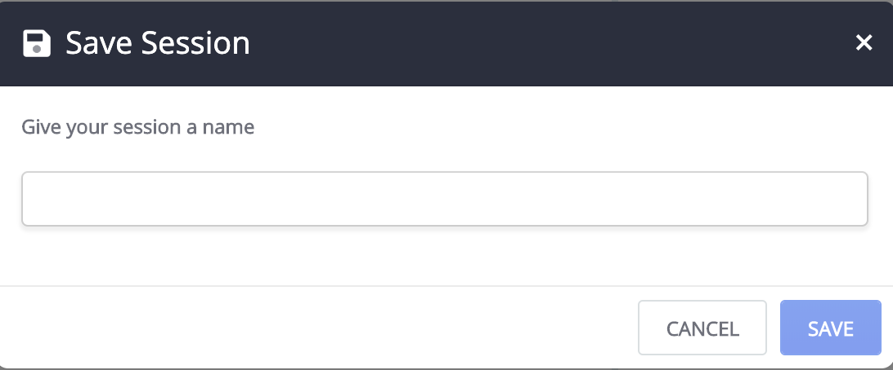

3. The saved sessions are immediately loaded in the __Sessions__ list.
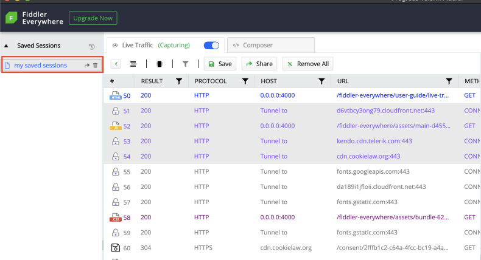

4. Double-click on the saved session to load it in the __Live Traffic__ list.
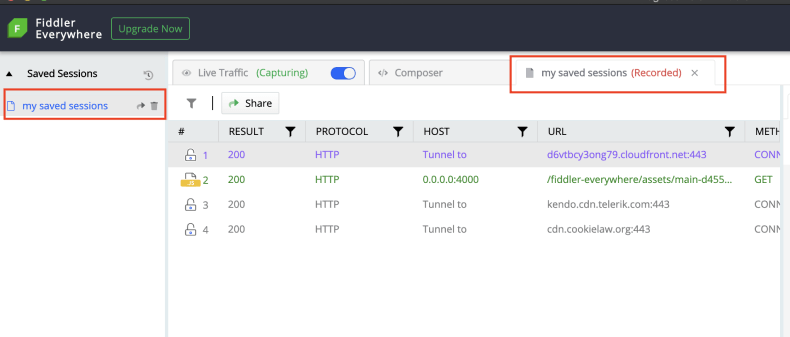

>tip Alternatively, you can save all captured traffic [via the __Save__ button from the toolbar](#save)

### Share

The context menu option __Share__ enables the sharing of sessions. Before any session is shared, it is saved as an entry in the __Sessions__ list. Then the entry can be shared via email.

- __Selected sessions__ - Saves & shares all selected sessions.
- __Unselected sessions__ - Saves & shares all unselected sessions.
- __All Sessions__ - Saves and shares all captured traffic.

All three options will initially display a save prompt and then a share prompt window.

1. Select the sessions, open the context menu,  and click on __Share__ option.
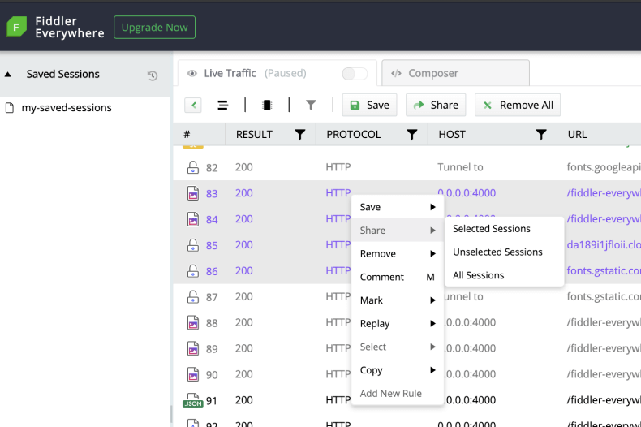

2. The selected sessions are being saved. Enter your session name and click __Save and proceed__


3. The share screen prompt window appears. Enter valid email and optionally add notes. Once ready, click __Share__.
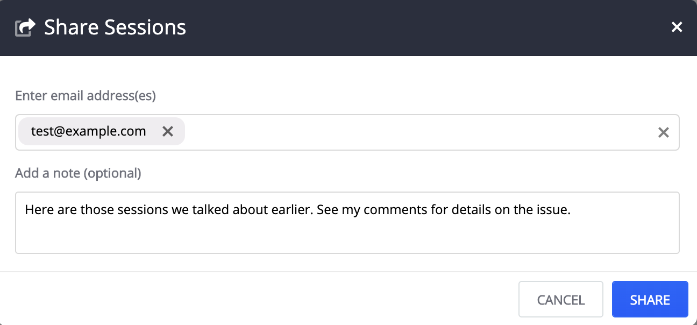

>important Fiddler Everywhere has a quota limit for creating snapshots of sessions. Refer to the FIddler Everywhere plans page for details.

>tip Alternatively, you can share captured traffic [via the __Share__ button from the toolbar](#share)

### Remove

Use the __Remove__ context menu options to delete sessions from your __Live Traffic__ list. 

- __Selected sessions__ - Removes all selected sessions. Keyboard shortcut: __Cmd__ + __Back__ (Mac), __Del__ (Windows).
- __Unselected sessions__ - Removes all unselected sessions. Keyboard shortcut: __Shift__ + __Cmd__ + __Back__ (Mac), __Shift__ + __Del__ (Windows).
- __All Sessions__ - Removes all captured traffic. Keyboard shortcut: __Cmd__ + __X__ (Mac), __Ctrl__ + __X__ (Windows).
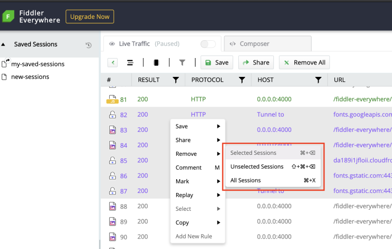

## Comment

Use the __Comment__ context menu option to add comments for the associated sessions. 

1. Select the sessions, open the context menu, and click on the __Comment__ option. Keyboard shortcut: __M__.

2. A __Comment__ dialog appears. Enter the comment and click __Ok__. 
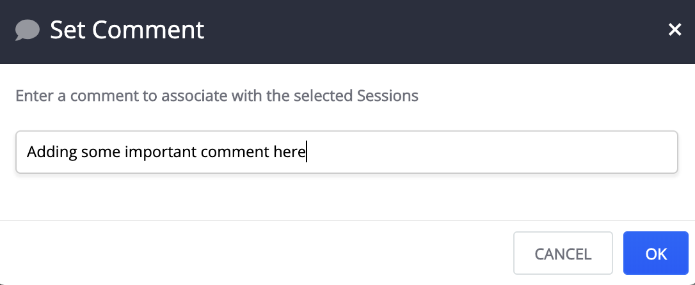

3. The text is added to the comment field for the selected sessions.
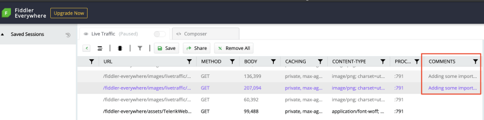

### Mark

Use the __Mark__ context menu option to apply different colors or to strikeout selected sessions.

1. Select the sessions, open the context menu, and click on __Mark__ option.

2. Click on the preferred marking style to apply it.
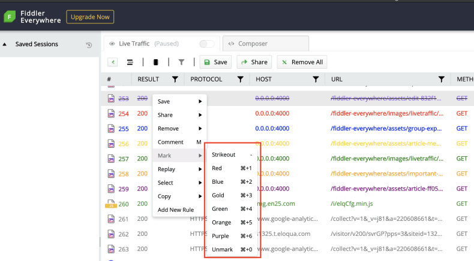

### Replay

Use the __Replay__ context menu option to replay previously captured sessions.  Keyboard shortcut: __R__.

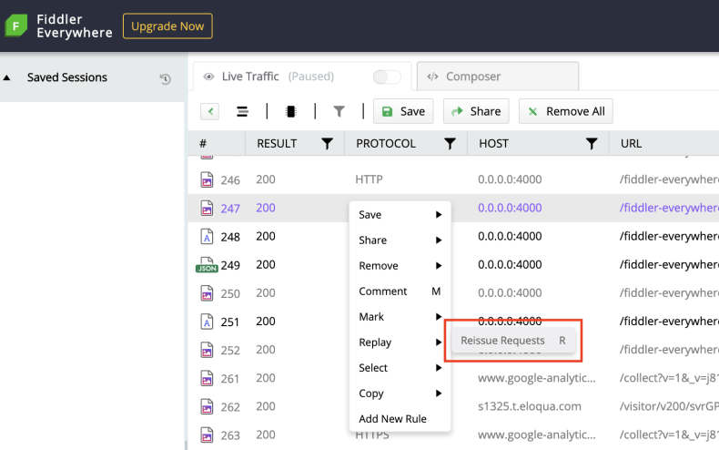

### Select

Use the __Select__ context menu option to select sessions that are directly related to the currently selected session. The options are to select __parent__, __children__, and __duplicate__ sessions.

- __Parent request__ Selects the session that is a parent of the currently selected session. Keyboard shortcut: __P__
- __Children requests__ Selects the sessions that are children of the currently selected session. Keyboard shortcut: __C__
- __Duplicaterequest__ Selects the session that is a duplicate to the currently selected session. Keyboard shortcut: __D__


### Copy

Use the __Copy__ context menu option to place a session information in the clipboard. The copied information options are:

- __URL__ Provides the session URL. Keyboard shortcut:__Cmd__ + __U__ (Mac), __Ctrl__ + __U__ (Windows)
- __FUll Summary__ Provides verbose session details. Keyboard shortcut: __Cmd__ + __C__ (Mac), __Ctrl__ + __C__ (Windows)

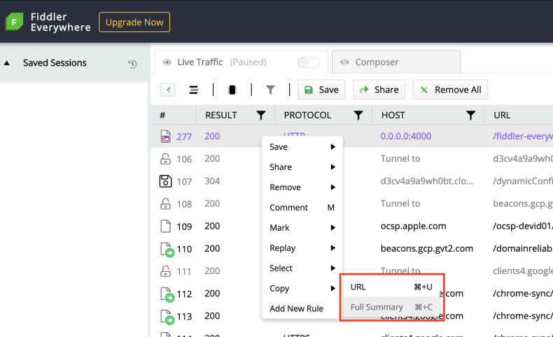

_Example for copying URL_
```
http://0.0.0.0:4000/fiddler-everywhere/images/livetraffic/websessions/websessions-list-share-options.png
```

_Example for copying full info_
```
#	RESULT	PROTOCOL	HOST	URL	METHOD	BODY	CACHING	CONTENT-TYPE	PROCESS	COMMENTS
277	200	HTTP	0.0.0.0:4000	/fiddler-everywhere/images/livetraffic/websessions/websessions-list-share-options.png	GET	207,094	private, max-age=0, proxy-revalidate, no-store, no-cache, must-revalidate	image/png; charset=utf-8		
```

### Add New Rule

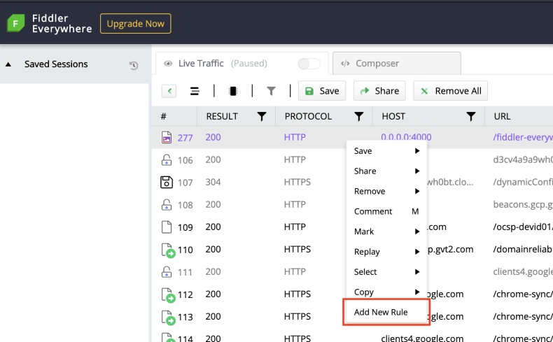