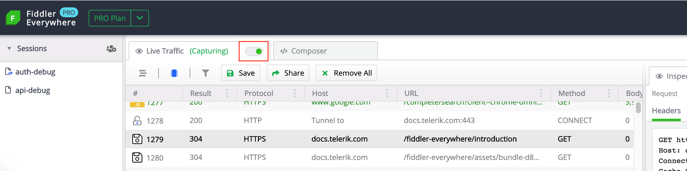
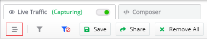
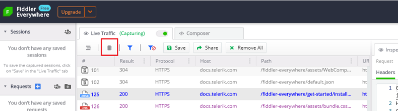
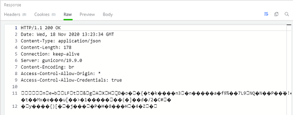
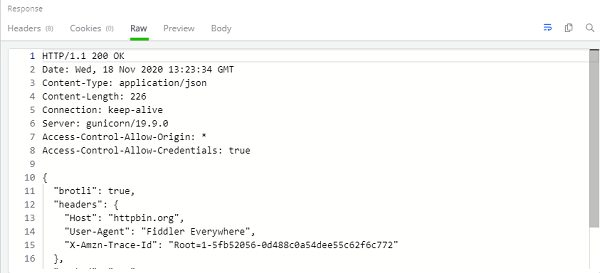
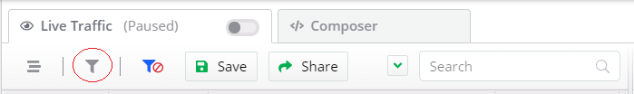
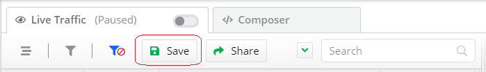
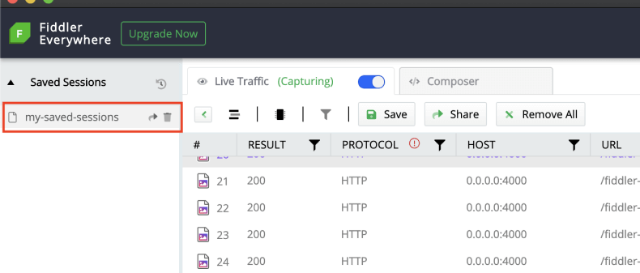
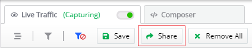
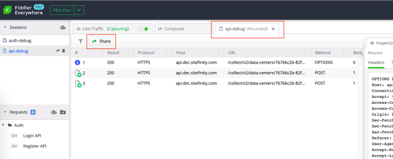

# Web Sessions Toolbar

The Web Sessions toolbar provides various functionalities like streaming mode, decoding content, filtering by criteria, saving, and sharing sessions.

To use capture Web Sessions, you need to enable __Live Traffic__ capturing via the switch. Enabling the __Live Traffic__ switch will continuously capture all web traffic. You can use the off switch state to turn off (pause) the traffic capturing.

## Stream

By default, Fiddler Everywhere uses __buffering mode__, which means that the responses are fully collected before any part is sent to the client. Buffering alters the responses (for example, an image won't begin to download until the containing page download is complete). With __streaming mode__, the server's responses are immediately returned to the client as it is downloaded. In streaming mode, tampering with the response body is not possible.

1. Click on the __Stream__ button to enable/disable the streaming mode.

Streaming mode is useful for low-level network timing scenarios (for example, by design some browsers will parse partially-downloaded HTML, and that would start downloading external resources in parallel before the remote server has finished delivering the content).

 Streaming mode is also useful in cases where a site delivers audo or video streams. These kind of never-ending streams can't be buffered by Fiddler Everywhere.

## Decode

Use __Decode__ toggle button to remove all HTTP content and Transfer enconding from requests and responses.

1. Click on the __Toggle__ button to enable/disable decoding the encoded content.

_Example HTTP response with_ *Decode* _toggled to OFF_

_Example HTTP response with_ *Decode* _toggled to ON_

## Filter

Use __Filter__ to apply advanced filters based on the Request and Response headers. Only sessions that are covering the filter criteria will appear in the Web Sessi0ons list.

1. Click on the filter button to open the advanced filters popup windows.

2. The advanced filters windows allow you to set specific criteria that will filter the captured traffic. Set the filter rules and click __Apply__.

## Save

Use __Save__ buttton to save sessions for later use or to prepare sessions for sharing.

1. Click on __Save__

2. A __Save Sessions__ prompt windows appears. Enter valid name and click __Save__.

3. The current sessions entry appears in __Saved Sessions__ list.

>important The __Save__ button will automatically save all captured traffic. If you want to save only specific sessions, you can select the wanted sessions and use [the context menu](#save) for advanced save options.

## Share

Sharing sessions greatly improves colaboration and Fiddler Everywhere provides several options to export and share sessions:

- Sharing via __Share__ button from the __Web Sessions__ list toolbar.
- Sharing via __Share__ button from the toolbar of already saved session (in __Saved Sessions__).
- Sharing via __Share__ option from the __Web Sessions__ list context menu.
- Sharing by exporting saved sessions in __SAZ__ format (context menu in __Saved Sessions__).
- Sharing by exporting in different session formats (via [File menu](#export-sessions))

This article demonstrates how to share sessions using the first two options. See the linked articles for examples on how to use exporting or sharing via the context menu.

### Share Live Traffic Sessions

The toolbar comes with __Share__ button that will save the currently displayed sessions (captured from __Live Traffic__) in a file, and then shares them through email (provided explicitly).

1. Click on the __Share__ button.

2. The __Save Session__ prompt window appears. You need to save the sessions before they could be shared.

3. The __Share Sessions__ prompt window appears. Enter a valid email (mandatory) and notes (optional) and click on __Share__ button.

### Share Previosly Saved Sessions

1. Double-click on the saved sessions entry from __Saved Sessions__ list.

2. The selected entry opens in a new tab. Click on the __Share__ button.

3. The __Share Sessions__ prompt window appears. Enter a valid email (mandatory) and notes (optional) and click on __Share__ button.

## Remove All

The __Remove All__ button is removing all currently  captured traffic from the __Web Sessions__ list.