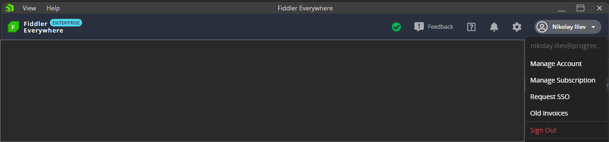
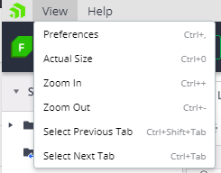
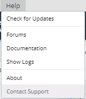

# Main Menu Tab

The main menu in Fiddler Everywhere is located at the top and consists of a set of areas that provide multiple functionalities, settings, and information&mdash;for example, the [**View**](#view) to the left, the [**Help**](#help) submenus and the [**Manage Subscriptions** options](#manage-subscriptions), the [**Feedback**](#feedback), [**Links**](#links), [**Notifications**](#notifications), and [**Settings**](#settings) as well as the current user [**Sign Out**](#sign-out) options to the right.

## View

The **View** menu provides options for changing the overall Fiddler Everywhere UI size by zooming in or out.

- The **Preferences** option enables you to load the Fiddler Everywhere settings window; can be accessed with the keyboard by pressing __Cmd__ (on Mac), or __Ctrl__ and **,** (on Windows).
- The **Actual Size** option can be accessed with the keyboard by pressing __Cmd__ and __0__ (on Mac), or __Ctrl__ and __0__ (on Windows).
- The **Zoom In** option can be accessed with the keyboard by pressing __Cmd__ and __+__ (on Mac), or __Ctrl__ and __+__ (on Windows).
- The **Zoom Out** option can be accessed with the keyboard by pressing __Cmd__ and __-__ (on Mac), or __Ctrl__ and __-__ (on Windows).
- The **Select Previous Tab** option can be accessed with the keyboard by pressing __Ctrl__, __Shift__ and __Tab__ (on Mac), or __Ctrl__, __Shift__, and __Tab__ (on Windows).
- The **Select Next Tab** option can be accessed with the keyboard by pressing __Ctrl__ and __Tab__ (on Mac), or __Ctrl__ and __Tab__ (on Windows).

## Help

The **Help** menu provides options for a version update and information, fast access to forums, documentation, and support channel.

- **Release notes**&mdash;Opens a screen that lists the Fiddler Everywhere release notes.
- **Check for Updates**&mdash;Contacts a web service to determine whether this is the latest version of Fiddler Everywhere. If not, you can choose to install the latest version immediately or when next starting Fiddler Everywhere.
- **Forums**&mdash;Opens a new browser tab with the [Fiddler Everywhere **Forums** portal](https://community.getfiddler.com/support/discussions) where you can search for use cases, report issues and bugs, and request features.
- **Documentation**&mdash;Opens a new browser tab with the [Fiddler Everywhere documentation website](https://docs.telerik.com/fiddler-everywhere/).
- **Open Application Logs Folder**&mdash;Opens the local folder that contains the Fiddler Everywhere log files. For more information, refer to the article on [using the log files for troubleshooting your local setup]().
- **About**&mdash;Opens a dialog window that provides information about the current version and build date of Fiddler Everywhere.
- **Contact Support**&mdash;Available for both the trial and [commercial](#key-features) versions. The support option uses the default email client of the operating system.

## Manage Subscriptions

The **Manage Subscriptions** window redirects to the [Fiddler dashboard site]() located at https://dashboard.getfiddler.com where account owners can manage their subscription plans, add and remove seats, update payment details, and more. Users that are not account owners will be able to see their subscription status.

## Feedback

The **Feedback** option enables you to send recommendations and feedback on the Fiddler Everywhere client application.

## Links

The **Links** menu provides the following useful fast links:

* **Forums** links to the Fiddler Everywhere community forums at https://community.getfiddler.com/support/discussions.
- **Documentation** links to the Fiddler Everywhere official documentation at https://docs.telerik.com/fiddler-everywhere/.
- **Contact Support** links to posting a support ticket to the Fiddler Everywhere support team. For more information, refer to the article on the [support options provided by Fiddler Everywhere](#support-options).

## Notifications

The **Notifications** button shows a drop-down list that contains the most recently received notifications. The Fiddler Everywhere application will send and receive notifications upon using collaboration functionalities such as sharing session logs, composer collections, and rulesets.

## Settings

The **Settings** button opens a window that allows you to manage core Fiddler Everywhere functionalities like secure traffic enablement, remote connections, bypassing addresses, privacy, and more.

For more information, refer to the following documentation articles about each **Settings** window section.

- [**HTTPS** menu]()
- [**Connections** menu]()
- [**Gateway** menu]()
- [**Privacy** menu]()
- [**Composer** menu]()
- [**Rules** menu]()
- [**Themes** menu]()

## Sign Out

The **Sign Out** button allows you to log out of the currently logged user and navigate to an introduction page that provides options for creating a new user, or using another existing account.
