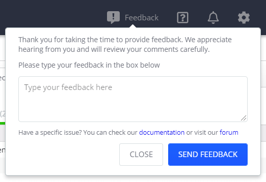
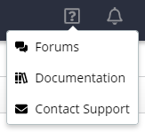
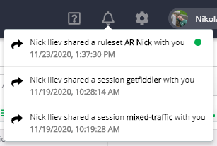

# Main Menu

The main menu in Fiddler Everywhere is placed at the top and consists of several areas that provide multiple functionalities, settings, and information. To the left, you could find the [**View**](#view), and [**Help**](#help) submenus plus [Manage Subscriptions options](#manage-subscriptions). To the right, you will find [**Feedback**](#feedback), [**Links**](#links), [**Notifications**](#notifications), [**Settings**](#settings), and current user [**Sign Out**](#sign-out) option.

## View

The **View** menu provides options to change the overall Fiddler Everywhere UI size using zoom in and zoom out.

- **Preferences** option to load the Fiddler Everywhere settings window. Keyboard shortcut: __Cmd__ (Mac), __Ctrl and ,__ (Windows). 

- **Actual Size** option. Keyboard shortcut: __Cmd and 0__ (Mac), __Ctrl and 0__ (Windows). 

- **Zoom In** option. Keyboard shortcut: __Cmd and +__ (Mac), __Ctrl and +__ (Windows). 

- **Zoom Out** option. Keyboard shortcut: __Cmd and -__ (Mac), __Ctrl and -__ (Windows). 

- **Select Previous Tab** option. Keyboard shortcut: __Ctrl, Shift and Tab__ (Mac), __Ctrl, Shift and Tab__ (Windows). 

- **Select Next Tab** option. Keyboard shortcut: __Ctrl and Tab__ (Mac), __Ctrl and Tab__ (Windows). 

## Help

The **Help** menu provides several options for a version update and information, fast access to forums, documentation, and support channel. The support option is available only for [Fiddler Everywhere PRO](#key-features) version.

- **Release notes** - Opens a screen that lists the Fiddler Everywhere release notes.

- **Check for Updates** - The **Check For Updates** option contacts a web service to determine whether this is the latest version of Fiddler. If not, you can choose to install the newest version immediately or on Fiddler Everywhere next start.

- **Forums** - The **Forums** option opens a new browser tab with the [Fiddler Everywhere forums portal](https://community.getfiddler.com/support/discussions). Use the forums to search for possible use cases, report issues and bugs, and request features.

- **Documentation** - The **Documentation** option opens a new browser tab with the [Fiddler Everywhere documentation website](https://docs.telerik.com/fiddler-everywhere/).

- **Open Application Logs Folder** - The **Open Application Logs Folder** option opens the local folder that contains the Fiddler Everywhere log files. Learn more [here]() about how to use the log files for troubleshooting your local setup.

- **About** - The **About** command opens a dialog window that provides information about the Fiddler Everywhere client's current version and build date.

    

- **Contact Support** -The **Contact Support** is available for [Fiddler Everywhere PRO](#key-features) version (including the **Trial** version). The option uses the operating system default email client.

## Manage Subscriptions

The **Manage Subscriptions** window will redirect the user to the [Fiddler dashboard site]() located at https://dashboard.getfiddler.com. Account owners will manage the subscription plans, add and remove seats, update payment details, etc. Users that are not account owners will be able to see their subscription status.

## Feedback

Use the **Feedback** option to send us your observations, recommendations, and impressions for the Fiddler Everywhere client application.

## Links

The **Links** menu provides several useful fast links.

- A **Forums** link to the Fiddler Everywhere community forums at https://community.getfiddler.com/support/discussions
- A **Documentation** link to the Fiddler Everywhere official documentation at https://docs.telerik.com/fiddler-everywhere/
- A **Contact Support** link (available only for PRO & Trial versions) for posting a support ticket to the Fiddler Everywhere support team. More about Fiddler Everywhere PRO support [here]().

## Notifications

The **Notifications** button shows a drop-down list that contains the most recently received notifications. The Fiddler Everywhere application will send and receive notifications upon using the collaboration functionalities (like sharing session logs, composer collections, and Rules Builder rulesets).

## Settings

The **Settings** button opens a window that allows you to manage core Fiddler Everywhere functionalities like secure traffic enablement, remote connections, bypassing addresses, privacy, and more. Refer to the detailed documentation articles to learn more about each section in the **Settings** window.

- [**HTTPS** section]()
- [**Connections** section]()
- [**Gateway** section]()
- [**Privacy** section]()
- [**Composer** section]()

## Sign Out

The **Sign Out** button allows you to log out of the currently logged user. Click on the button to log out and navigate to [an intro page](#create-an-account) that provides options to create a new user or use another existing account.