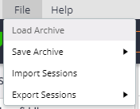
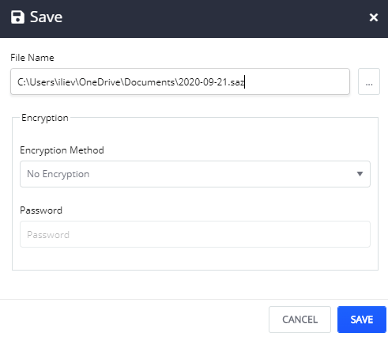
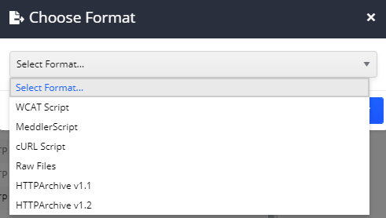
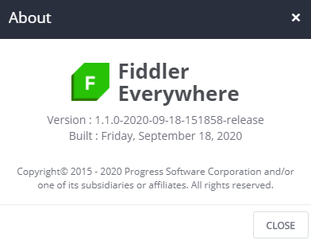

The main menu in Fiddler Everywhere is placed at the top toolbar and consists of **File** and **Help** submenus.

## File Menu

The **File** menu contains commands to load and store captured traffic. The menu provides options to create and load an archive that includes the whole captured traffic (creates a SAZ file) and an option to import/export only specific sessions.

### Load Archive

The **Load Archive** command allows you to reload previously-captured traffic stored in a SAZ file. The content will be loaded in the **Sessions** list.

### Save Archive

The **Save Archive** sub-menu exposes options that allow you to save traffic to SAZ files. You can save all current sessions or just the selected sessions. 

After selecting an option, a **Save** prompt will appear. The dialog provides opportunities to use encryption (AES256) to create a password-protected archive.
   

### Import Sessions

The **Import Sessions** command allows you to import previously-captured traffic from various file formats.

### Export Sessions

The **Export Sessions** sub-menu exposes options to export traffic in various file formats. You can export all current sessions or just the selected sessions. 

After selecting an option, a **Choose Format** prompt will appear. The supported formats are as follows:
- WCAT Script
- MeddlerScript
- cUrl Script
- Raw File
- HttpArchive v1.1
- HttpArchive v1.2

## Help Menu

The **Help** menu provides an option to check for updates and install the latest version of Fiddler Everywhere.

### Check for Updates

The **Check For Updates** command contacts a web service to determine whether this is the latest version of Fiddler. If not, you can choose to install the newest version immediately or on Fiddler Everywhere next start.

### Forums

The **Forums** command opens a new browser tab with the Fiddler Everywhere forums portal.

### Documentation

The **Documentation** command opens a new browser tab with the Fiddler Everywhere documentation website.

### About

The **About** command opens a dialog window that provides information about the Fiddler Everywhere client's current version and build date.

