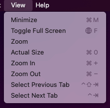

# Main Menu Tab

The main menu in Fiddler Everywhere is located at the top and consists of a set of areas that provide multiple functionalities, settings, and information&mdash;for example, the [**View**](#view) to the left, the [**Help**](#help) submenus and the [**Manage Subscriptions** options](#manage-subscriptions), the [**Feedback**](#feedback), [**Links**](#links), [**Notifications**](#notifications), and [**Settings**](#settings) as well as the current user [**Sign Out**](#sign-out) options to the right.

## View

The **View** menu provides options for changing the overall Fiddler Everywhere UI size by zooming in or out. The **View** menu differs depending on the operating system.

### View (Windows)

- The **Preferences** option enables you to load the Fiddler Everywhere settings window. Access it with the keyboard by pressing `Cmd` (on Mac), or `Ctrl` and `,` (on Windows).
- The **Actual Size** option can be accessed with the keyboard by pressing `Cmd` and `0` (on Mac), or `Ctrl` and `0` (on Windows).
- The **Zoom In** option can be accessed with the keyboard by pressing `Cmd` and `+` (on Mac), or `Ctrl` and `+` (on Windows).
- The **Zoom Out** option can be accessed with the keyboard by pressing `Cmd` and `-` (on Mac), or `Ctrl` and `-` (on Windows).
- The **Select Previous Tab** option can be accessed with the keyboard by pressing `Ctrl`, `Shift`, and `Tab` (on Mac), or `Ctrl`, `Shift`, and `Tab` (on Windows).
- The **Select Next Tab** option can be accessed with the keyboard by pressing `Ctrl` and `Tab` (on Mac), or `Ctrl` and `Tab` (on Windows).

### View (macOS)

- The **Minimize** option to collapse the Fiddler Everywhere application in the macOS toolbar fully. It can be accessed by pressing `Cmd` and `M`.
- The **Toogle Full Screen** option to fully expand the Fiddler Everywhere application on the whole screen. It can be accessed by pressing `Opt` and `F`.
- The **Zoom** option to zoom the Fiddler Everywhere application.
- The **Actual Size** option can be accessed with the keyboard by pressing `Cmd` and `0` (on Mac), or `Ctrl` and `0` (on Windows).
- The **Zoom In** option can be accessed with the keyboard by pressing `Cmd` and `+` (on Mac), or `Ctrl` and `+` (on Windows).
- The **Zoom Out** option can be accessed with the keyboard by pressing `Cmd` and `-` (on Mac), or `Ctrl` and `-` (on Windows).
- The **Select Previous Tab** option can be accessed with the keyboard by pressing `Ctrl`, `Shift`, and `Tab` (on Mac), or `Ctrl`, `Shift`, and `Tab` (on Windows).
- The **Select Next Tab** option can be accessed with the keyboard by pressing `Ctrl` and `Tab` (on Mac), or `Ctrl` and `Tab` (on Windows).

## Help

The **Help** menu provides options for a version update and information, and fast access to forums, documentation, and support channel.

- **Release notes**&mdash;Opens a screen that lists the Fiddler Everywhere release notes.
- **Check for Updates**&mdash;Contacts a web service to determine whether this is the latest version of Fiddler Everywhere. If not, you can choose to install the newest version immediately or when next starting Fiddler Everywhere.
- **Forums**&mdash;Opens a new browser tab with the [Fiddler Everywhere **Forums** portal](https://community.getfiddler.com/support/discussions), where you can search for use cases, report issues and bugs, and request features.
- **Documentation**&mdash;Opens a new browser tab with the [Fiddler Everywhere documentation website](https://docs.telerik.com/fiddler-everywhere/).
- **Open Application Logs Folder**&mdash;Opens the local folder that contains the Fiddler Everywhere log files. For more information, refer to the article on [using the log files for troubleshooting your local setup]().
- **About**&mdash;Opens a dialog window that provides information about the current version and build date of Fiddler Everywhere. On macOS, the dialog also contains information about the type of the build (Apple Silicon(arm64) for [Mac computers with Silicon chips](https://support.apple.com/en-us/HT211814) versus Intel(x64) for Mac computers with Intel chips).
- **Contact Support**&mdash;Available for both the trial and [commercial](#key-features) versions. The support option loads the official support center at https://www.telerik.com/account/support-center

## Feedback

The **Feedback** option lets you send recommendations and feedback on the Fiddler Everywhere client application.

## Links

The **Links** menu provides the following useful fast links:

- **Forums** link to the Fiddler Everywhere community forums at https://www.telerik.com/forums/fiddler.
- **Documentation** link to the Fiddler Everywhere official documentation at https://docs.telerik.com/fiddler-everywhere/.
- **Contact Support** link to the official [support center](https://www.telerik.com/account/support-center) from whee all licensed and trial users can post a ticket. For more information, refer to the article on the [support options provided by Fiddler Everywhere]().

## Notifications

The **Notifications** button shows a drop-down list that contains the most recently received notifications. The Fiddler Everywhere application will send and receive notifications upon using collaboration functionalities such as sharing session logs, composer collections, and rulesets.

## Settings

The **Settings** button opens a window that allows you to manage core Fiddler Everywhere functionalities like secure traffic enablement, remote connections, bypassing addresses, privacy, and more.

Refer to the following documentation articles about each **Settings** window section for more information.

- [**HTTPS** menu]()
- [**Connections** menu]()
- [**Gateway** menu]()
- [**Privacy** menu]()
- [**Composer** menu]()
- [**Rules** menu]()
- [**Themes** menu]()

## My Account

The last section of the main menu provides accoiunt specific options and information. Immediatly visibile are the first and the last name of logged Fiddler Everywhere user (as specfied during the registration).

- **Manage Account**&mdash;Direct link to the [**Account Overview**](https://wwwuat.telerik.com/account/) section at the https://www.telerik.com site.
- **Manage Subscription**&mdash;Direct link to the [**Your Licenses**](https://wwwuat.telerik.com/account/your-licenses) section at the https://www.telerik.com site.
- **Sign Out**&mdash;Allows you to log out of the currently logged user from the Fiddler Everywhere application and from the https://www.telerik.com site.
