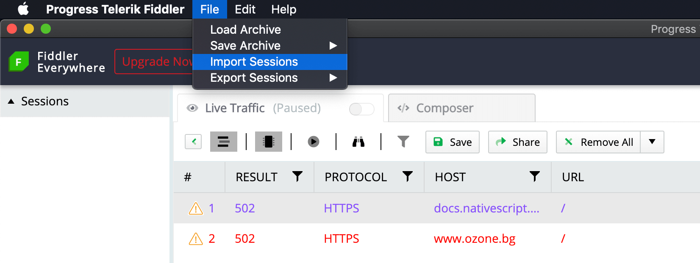
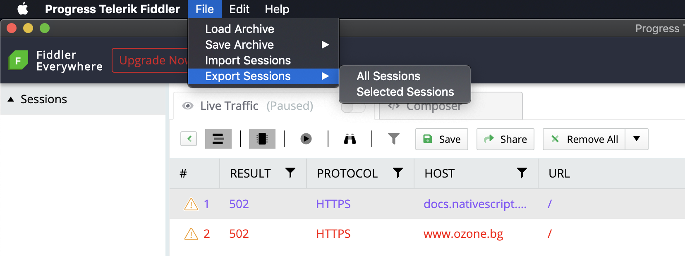

## File Menu

The File menu contains commands to load and store captured traffics. The menu provides options to create and load an archive that includes the whole captured traffic (creates a SAZ file) as well as an option to import/export only specific sessions.

>tip A **SAZ** file in Fiddler Everywhere is a term that describes an archive that holds a **snapshot** of single or multiple sessions (captured traffic). The **SAZ** files can be loaded as snapshot entries in the **Sessions** list or shared with other Fiddler Everywhere users. A good practice is to protect your SAZ files with an encrypted password while [creating the archive](#save-archive).

## Load Archive

The **Load Archive** command allows you to reload previously-captured traffic stored in a SAZ file. The content will be loaded as a snapshot in the **Sessions** list.

## Save Archive

The **Save Archive** submenu exposes options that allow you to save traffic to SAZ files. You can save all current sessions or just the selected sessions. 

After selecting an option, a **Save** prompt will appear. The dialog provides options to use encryption (AES256) to create a password-protected archive.

## Import Sessions

The **Import Sessions** command allows you to import previously-captured traffic from various file formats.

## Export Sessions

The **Export Sessions** submenu exposes options to export traffic in various file formats. You can export all current sessions or just the selected sessions. 

After selecting an option, a **Choose Format** prompt will appear. The supported formats are as follows:
- WCAT Script
- MeddlerScript
- cUrl Script
- Raw File
- HttpArchive v1.1
- HttpArchive v1.2

