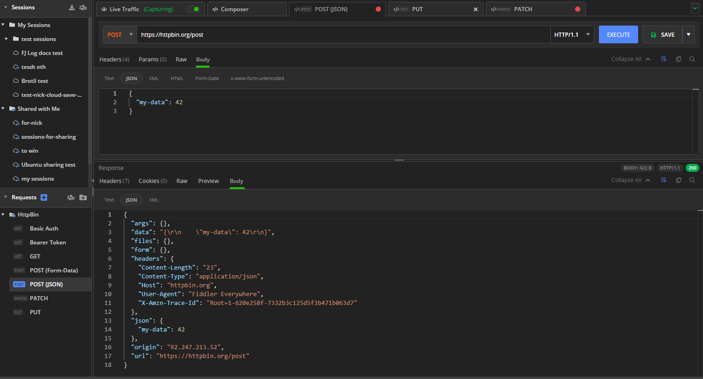
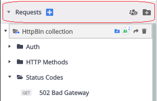
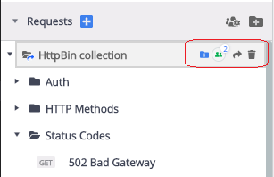
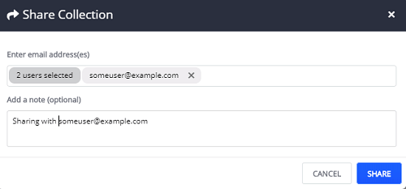
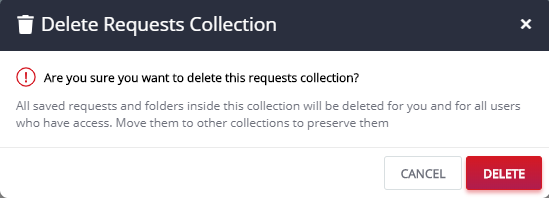
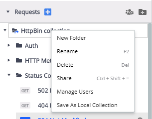
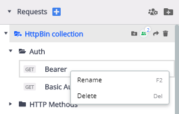

## Requests List

The **Requests** list in Fiddler Everywhere provides the option to save, modify, execute, and share the previously composed requests. The [Composer](https://docs.telerik.com/fiddler-everywhere/user-guide/composer) tab enables you to build and send HTTP and HTTPS request manually. When you **save** a request using the Composer, the request is added to the collection of requests in the **Requests** list. 

The **Requests** list looks like as shown in the image below: 

The Requests list contains one or more collections (folders) of saved requests. You can also further organize your request in subfolders. To reload or start working on the saved requests, expand a collection, and double click on a selected request. 

>tip You can [**Rename**](#rename), [**Delete**](#delete), or make a [**New Folder**](#new-folder) using the context menu. 

## Requests Menu 
The **Requests menu** contains three buttons situated to the right of the section title.

- Use the  button to open a new **Composer** tab.
- Use the **Shared Collections** icon to list and manage the root request collections (folders).
- Use the **Create New Collection** to create a new collection folder at the Requests list's root level.

## Collection Menu

The **Collection menu** contains several options to manage your currently selected requests collection (folder).

- Use the **Create New Collection** option to create a new collection folder at the selected collection root level.
- Use the **Manage Shared Collection** option to list and manage users with shared access rights.
- Use the [**Share Collection**](#share-collection) option to open the sharing prompt and provide users with shared access rights.
- Use the [**Delete**](#delete) option to delete the selected collection completely. This action will also remove the collection for shared users.

### Share Collection

To share a collection, click on the __Share__ icon to prompt a window where you must mention the email ids of the users you want to share with. 

>tip This feature is only available if you are the collection owner. 

### Delete 

The delete option will remove a selected collection or a specific request from the Requests list. 

Follow these steps to delete a collection: 

- Click on the **delete** icon of the folder. 
- A prompt window appears for final confirmation. 
- Click __Delete__. 

>tip You could also delete a specific sub-folder or a particular request using the **delete** option for the selected entry.

## Collection Context Menu 

Each collection has options accessible via a context menu. 

- **New Folder**: Creates __new folder__ within the selected collection.

- **Rename**: Renames the selected collection. This option is only applicable for the collection owner. _Keyboard shortcut: __F2__ (Mac), __F2__ (Windows)._

- **Delete**: Deletes the collection from the Requests list. TWill also delete all the requests present in the collection. If the collection is shared, this action will also remove the collection for the shared users. _Keyboard shortcut: __CMD + Back__ (Mac), __Del__ (Windows)._

- **Share**: Triggers the **Share Collection** window. _Keyboard shortcut: __CMD + Shift + =__ (Mac), __Ctrl + Shift + =__ (Windows)._ 

- **Manage Users**: Lists the users with shared access rights. You can use this option to remove users.

- **Save As Local Collection**: Makes a local copy of your cloud saved collection. Useful for testing changes that you don't need to share with the collaborators using the cloud collection. _The option is available only for cloud collections_.

- **Duplicate Collection**: Makes a local copy of your collection. _The option is available only for locally saved collections_.

## Requests Context Menu

Each  __requests__ has options to either __Rename__ or __Delete__ via its context menu (or via keyboard shortcuts).

- **Rename**: Renames the selected request. _Keyboard shortcut: __F2__ (Mac), __F2__ (Windows)._ 

- **Delete**: Deletes the selected request from the collection. _Keyboard shortcut: __CMD + Back__ (Mac), __Del__ (Windows)._ 

>tip Each saved request can be updated by inputting the modification (for example, in the Headers) and pressing the __Save__ button. If you want to save a new instance of an already saved request, use the __Save as__ drop-down option (available only for already saved requests).
