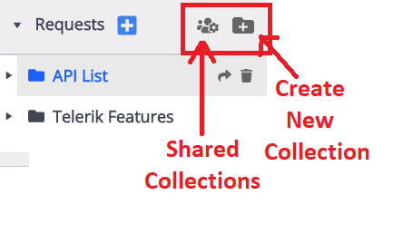
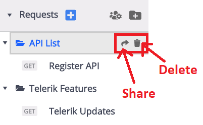
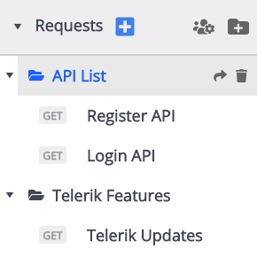
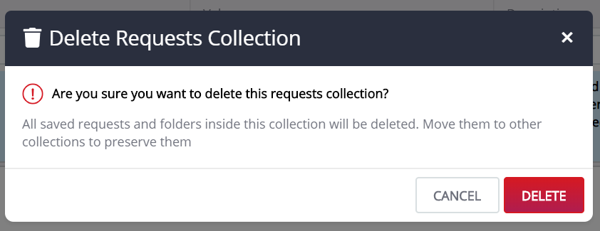
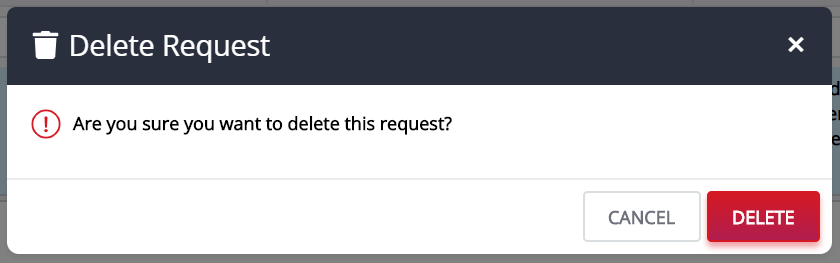
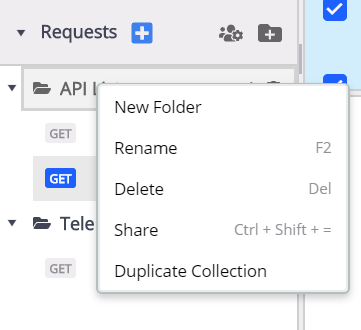
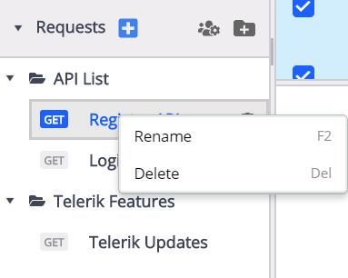

## Requests

The Fiddler Everywhere client provides the option to save and share the composed requests. Previously, we discussed on the [Composer](https://docs.telerik.com/fiddler-everywhere/user-guide/composer) feature which enables you to manually build and send HTTP, HTTPs and FTP requests. When you save a request using the Composer, the request is added to the collection of requests in the Requests list. 

The Request list looks like as shown in the image below: 

The Requests list contains one or more collection (folders) of saved requests. In the above image, two different requests have been saved to two different folders. To reload or start working on the saved requests, simply expand a collection and double click on a selected request. 

>tip You can __Rename__ or __Delete__ the collections using the context menu. 

## Requests Menu 

The Fiddler Everywhere requests menu contains list of options which can be executed to share or create new collection. You can also create a new Request using the  button. Refer to the image below: 

When you save a Composer Request, they automatically get appended to the Requests list. In the list each Requests has some options to be executed. Refer to the image below: 

## Manage Requests Tab

The Requests tab contains the folders containing the composer requests. You can create as many folders and requests as you want. Every folder created under the Requests tab can have more than one requests. 

As the composer allows you to compose requests and test those requests, the folders under requests help in differentiating different types of requests. It comes in handy when you want to share the request with a teammate or someone you are working with. 

If you are using a [Pro version](https://www.telerik.com/purchase/fiddler) of the Fiddler Everywhere, you can share __n__ number of requests with anyone. 

#### Share 

To share the requests folder click on the __Share__ icon to prompt a window where you must mention the email ids of the users you want to share with. 

The sharing window looks like as shown below:

>tip This feature is only available if you own the session. 

#### Delete 

The delete option will remove the folder or the composer request from the Requests tab. You can either delete an individual request or the entire folder which contains more than one requests. 

To delete the requests folder: 

- Click on the delete icon of the folder. 
- Clicking the icon will prompt a window where the application asks for the final call of deleting the Requests folder. 
- Click __Delete__. 

The prompt window looks like as shown below: 

In a similar way you can also delete an individual request. To do that: 

- Click on the delete icon of the respective request. 
- Clicking the icon will prompt a window where the application asks for the final call of deleting the request. 
- Click __Delete__.  

The prompt window looks like as shown below: 

## Request Context Menu 

Each Requests folder have options that can be accessed via context menu (or with keyboard shortcuts). The dropdown looks like as shown below: 

The options available in the list is as follows:

#### New Folder 

The option lets you create a __new folder__ for the composer requests. You can either: 

- Add a new folder using this dropdown 
- Or a new folder can also be created while saving a Composer Request. 

#### Rename

The option allows you to __rename__ the requests folder. This option is only applicable for the session owner. Keyboard shortcut: __F2__ (Mac), __F2__ (Windows). 

#### Delete 

__Delete__ option is used to remove the request folder from the list. This also deletes all the requests present in the folder. Keyboard shortcut: __CMD + Back__ (Mac), __Del__ (Windows). 

#### Share

The option allows you to __share__ the requests folder. Clicking on the share option will prompt a window where you must mention the email ids of the users you want to share with. Keyboard shortcut: __CMD + Shift + =__ (Mac), __Ctrl + Shift + =__ (Windows). 

#### Duplicate Collection 

This option lets you create a duplicate folder of the existing one. The name of the folder is structured as __FolderName_Cloned__. 

## Individual Requests Dropdown

Each individual __requests__ have options to either __Rename__ or __Delete__ via dropdown menu (or with keyboard shortcuts). The dropdown looks like as shown below:

#### Rename 

The option allows you to __rename__ an individual request. This option is only applicable for the session owner. Keyboard shortcut: __F2__ (Mac), __F2__ (Windows). 

#### Delete

__Delete__ option is used to remove an individual request from the list. Keyboard shortcut: __CMD + Back__ (Mac), __Del__ (Windows). 

>tip Each saved request can be updated by inputting the modification (for example, in the Headers) and pressing the __Save__ button. If you want to save a new instance of already saved request use the __Save as__ drop-down option (available only for already saved requests)

