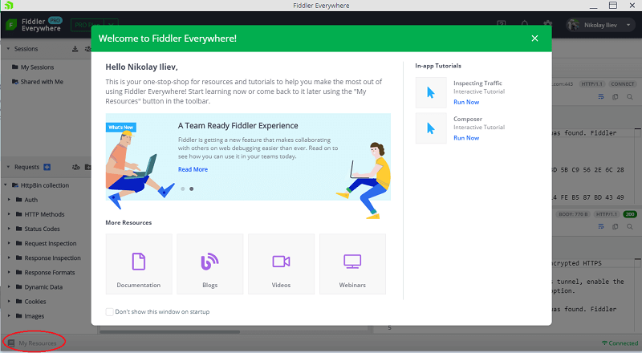
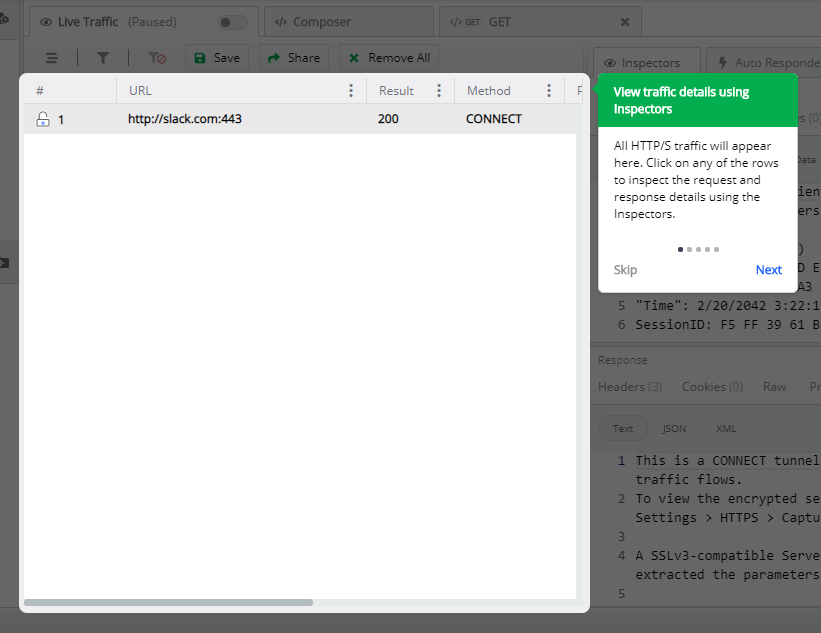

# Welcome Page

The welcome page loads upon startup of the Fiddler Everywhere application. The page contains useful information about the current release of Fiddler Everywhere, links to the official documentation, blogs, video channel, webinars, and interactive in-app tutorials.

The screen will show on consecutive startups unless explicitly disabled through the **_Don't show this window on startup_** checkbox. To show the welcome page, select the **My Resources** option  within the application located on the bottom-left side.

## Documentation

The **Documentation** link leads to the official documentation of Fiddler Everywhere hosted at [https://docs.telerik.com/fiddler-everywhere/introduction](https://docs.telerik.com/fiddler-everywhere/introduction?utm_medium=product&utm_source=doc&utm_campaign=fe_product_gettingstarted)

## Blogs

The **Blogs** link leads to the official blog of Fiddler Everywhere hosted at [https://www.telerik.com/blogs/fiddler?utm_medium=product&utm_source=blogs&utm_campaign=fe_product_gettingstarted](https://www.telerik.com/blogs/fiddler?utm_medium=product&utm_source=blogs&utm_campaign=fe_product_gettingstarted)

## Videos

The **Videos** link leads to the official YouTube video library for Fiddler Everywhere hosted at [https://www.youtube.com/playlist?list=PLvmaC-XMqeBYviLOpMOZ38Dsjpp6Qr4Y6](https://www.youtube.com/playlist?list=PLvmaC-XMqeBYviLOpMOZ38Dsjpp6Qr4Y6&utm_medium=product&utm_source=videos&utm_campaign=fe_product_gettingstarted)

## Webinars

The **Webinars** link leads to a web page that hosts recordings of past Fiddler Everywherewebinars hosted at [https://www.telerik.com/webinars/fiddler](https://www.telerik.com/webinars/fiddler?utm_medium=product&utm_source=webinar&utm_campaign=fe_product_gettingstarted)

## In-app Tutorials

The welcome page contains in-app tutorials with necessary steps explaining the core features of Fiddler Everywhere.  Start a tutorial to experience an interactive journey through Fiddler Everywhere.

