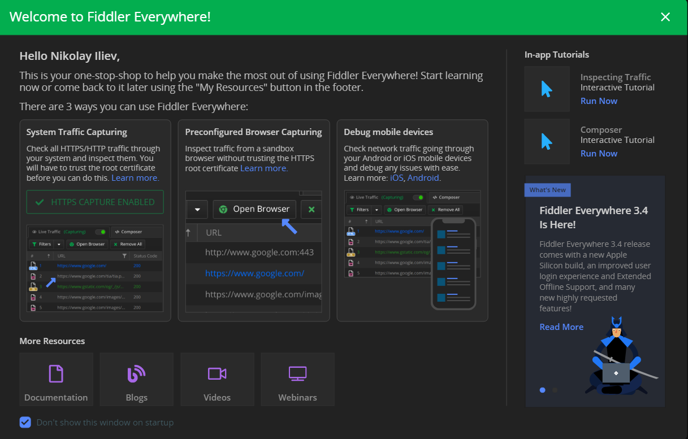
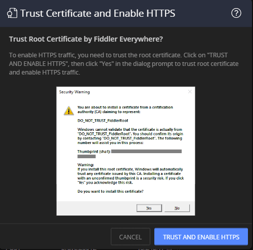

# Welcome Page

The **Welcome Page** loads with the startup of the Fiddler Everywhere application.

The page contains information about the current release of Fiddler Everywhere, links to the official documentation, blogs, video channel, webinars, and interactive in-app tutorials.

The screen will appear on consecutive startups unless you explicitly disable it by selecting the **Don't show this window on startup** checkbox. Select the **My Resources** option within the application located on the bottom-left side to display the welcome page. The following figure demonstrates the resources from the **Welcome Page**.

- **Get Started resources**&mdash;Provides interactive helper for enabling secure traffic system capturing and leads to different resources from the official Fiddler Everywhere documentation.

    >tip Immediately after the Fiddler Everywhere installation, the client will be able to capture only non-secure system traffic (HTTTP). Use the **ENABLE HTTPS CAPTURE** button from the **Welcome Page**, or the **Enable HTTPS now** link from the in-app notification to start an interactive helper that will lead you through the required configuration steps.

    

- **Documentation**&mdash;Leads to the [official documentation of Fiddler Everywhere](https://docs.telerik.com/fiddler-everywhere/introduction?utm_medium=product&utm_source=doc&utm_campaign=fe_product_gettingstarted).

- **Blogs**&mdash;Leads to the [official blog of Fiddler Everywhere](https://www.telerik.com/blogs/fiddler?utm_medium=product&utm_source=blogs&utm_campaign=fe_product_gettingstarted).

- **Videos**&mdash;Leads to the [official YouTube video library for Fiddler Everywhere](https://www.youtube.com/playlist?list=PLvmaC-XMqeBYviLOpMOZ38Dsjpp6Qr4Y6&utm_medium=product&utm_source=videos&utm_campaign=fe_product_gettingstarted).

- **Webinars**&mdash;Leads to a web page that hosts recordings of [past Fiddler Everywhere webinars](https://www.telerik.com/webinars/fiddler?utm_medium=product&utm_source=webinar&utm_campaign=fe_product_gettingstarted).

- **In-app tutorials**&mdash;The welcome page contains different in-app step-by-step tutorials explaining the core features of Fiddler Everywhere.

