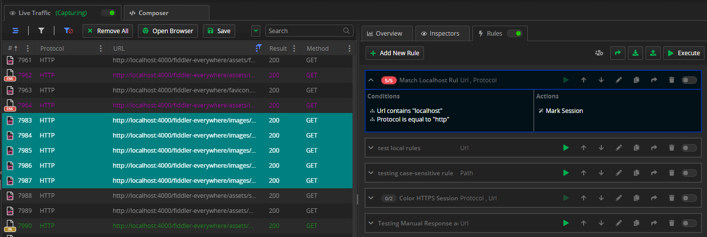

# Rules Tab

The **Rules** tab enables you to create rules that will automatically trigger in response to requests.

The **Rules** functionality provides options for testing different scenarios while sparing you with the efforts to change the client application or production server. You can use it to mock behavior, test new functionalities, reproduce previously captured bugs (from saved sessions, SAZ files, and other HTTP Session formats), and run website demos while you are offline.

The collaboration functionalities allow you to import and export a single rule or group of rules and share them directly with other Fiddler Everywhere collaborators. Each rule has a different order priority and execution weight, easily controlled by promoting or demoting a rule.

The **Rules** tab has improved UI capabilities by providing more convenient options to create matching conditions and actions. Now you can quickly organize rules into different groups to ease their future usage and to share them easily with collaborators.

The **Rules** tab contains the following sections:

- **Rules Toolbar**&mdash;Provides options for rule creation, group creation, sharing, manual import or export, and manual execution.
- **Rule Builder**&mdash;Creates new rules and edits existing ones.
- **Rules Queue**&mdash;A queue of rules and groups applied in the order of appearance from top to bottom. Each rule/group in the queue has its toolbar with different functionalities.

### Conditions

The **Rule Builder** can add and use single or multiple **conditions** needed to trigger different [**actions**](#actions). The conditions are logical structures with different statements whose numbers can vary between two and four. A statement field that handles text (string modifier) is case-insensitive by default (you can use the **Aa** button to change them to case-sensitive) and can be auto-completed with suggestions corresponding to the captured sessions.

For more information, refer to the following list. 

<table style="width: 100%">
    <colgroup>
       <col span="1" style="width: 14%;">
       <col span="1" style="width: 14%;">
       <col span="1" style="width: 14%;">
       <col span="1" style="width: 14%;">
       <col span="1" style="width: 44%;">
    </colgroup>
    <thead>
        <tr>
            <th>Condition Value</th>
            <th>Field Options</th>
            <th>Field Options</th>
            <th>Field Options</th>
            <th>Usage Description</th>
        </tr>
    </thead>
    <tbody>
        <tr>
            <td><b>Protocol</b></td>
            <td>HTTP or HTTPS</td>
            <td>n/a</td>
            <td>n/a</td>
            <td>Differentiate the traffic based on the used protocol (HTTP vs. HTTPS).</td>
        </tr>
        <tr>
            <td><b>Host</b></td>
            <td>String modifiers</td>
            <td>Search value</td>
            <td>n/a</td>
            <td>Matches a specific keyword in the <b>Host</b> column.</td>
        </tr>
        <tr>
            <td><b>Path</b></td>
            <td>String modifiers</td>
            <td>Search value</td>
            <td>n/a</td>
            <td>Matches a specific keyword in the <b>path</b> column.</td>
        </tr>
        <tr>
            <td><b>URL</b></td>
            <td>String modifiers</td>
            <td>Search value</td>
            <td>n/a</td>
            <td>Matches a specific keyword in the <b>URL</b> column.</td>
        </tr>
        <tr>
            <td><b>Status Code</b></td>
            <td>String modifiers</td>
            <td>Search value</td>
            <td>n/a</td>
            <td>Matches a specific keyword in the <b>Result</b> column.</td>
        </tr>
        <tr>
            <td><b>Method</b></td>
            <td>String modifiers</td>
            <td>Search value</td>
            <td>n/a</td>
            <td>Matches sessions using specific HTTP <b>Method</b>.</td>
        </tr>
        <tr>
            <td><b>Process</b></td>
            <td>String modifiers</td>
            <td>Search value</td>
            <td>n/a</td>
            <td>Matches a specific <b>Process ID</b>.</td>
        </tr>
        <tr>
            <td><b>Client IP</b></td>
            <td>String modifiers</td>
            <td>Search value</td>
            <td>n/a</td>
            <td>Matches session with specific <b>Client IP</b>.</td>
        </tr>
        <tr>
            <td><b>Remote IP</b></td>
            <td>String modifiers</td>
            <td>Search value</td>
            <td>n/a</td>
            <td>Matches session with specific <b>Remote IP</b>.</td>
        </tr>
        <tr>
            <td><b>Body Size</b></td>
            <td>Number modifiers (compares bytes)</td>
            <td>Search value</td>
            <td>n/a</td>
            <td>Matches session with specific <b>Body Size</b>.</td>
        </tr>
        <tr>
            <td><b>Duration</b></td>
            <td>Number modifiers (compares milliseconds)</td>
            <td>Search value</td>
            <td>n/a</td>
            <td>Matches sessions with specific <b>Duration</b>.</td>
        </tr>
        <tr>
            <td><b>Comment</b></td>
            <td>String modifiers</td>
            <td>Search value</td>
            <td>n/a</td>
            <td>Matches sessions with specific <b>Comment</b> column.</td>
        </tr>
        <tr>
            <td><b>Request Body</b></td>
            <td>String modifiers</td>
            <td>Search value</td>
            <td>n/a</td>
            <td>Matches sessions with specific keyword in the <b>Request Body</b> column.</td>
        </tr>
        <tr>
            <td><b>Request Header</b></td>
            <td>Header name</td>
            <td>String modifiers</td>
            <td>The search value </td>
            <td>Matches sessions with specific keyword in the <b>explicitly mentioned Request header</b> column.</td>
        </tr>
        <tr>
            <td><b>Response Body</b></td>
            <td>String modifiers</td>
            <td>Search value</td>
            <td>n/a</td>
            <td>Matches sessions with specific keyword in the <b>Response body</b>.</td>
        </tr>
        <tr>
            <td><b>Response Header</b></td>
            <td>Header name</td>
            <td>String modifiers</td>
            <td>The search value </td>
            <td>Matches sessions with specific keyword in the <b>explicitly mentioned Response header</b> column.</td>
        </tr>
        <tr>
            <td><b>Cookie</b></td>
            <td>Cookie name</td>
            <td>String modifiers</td>
            <td>Search value</td>
            <td>Matches sessions with specific keyword in the <b>explicitly mentioned Cookie</b>.</td>
        </tr>
        <tr>
            <td><b>Certificate Information</b></td>
            <td>Field name</td>
            <td>String modifiers</td>
            <td>Search value</td>
            <td>Matches sessions with specific keyword in the <b>explicitly mentioned certificate field</b>.</td>
        </tr>
        <tr>
            <td><b>Caching</b></td>
            <td>String modifiers</td>
            <td>Search value</td>
            <td>n/a</td>
            <td>Matches sessions with specific keyword in the <b>HTTP Headers related to content caching</b>.</td>
        </tr>
        <tr>
            <td><b>Content-Type</b></td>
            <td>String modifiers</td>
            <td>Search value</td>
            <td>n/a</td>
            <td>Matches sessions with specific keyword in the <b>Content-Type</b> column.</td>
        </tr>   
        <tr>
            <td><b>Request Time</b></td>
            <td>String modifiers</td>
            <td>Search value</td>
            <td>n/a</td>
            <td>Matches specific date string in the <b>Request Time</b> column.</td>
        </tr>  
        <tr>
            <td><b>Request Date</b></td>
            <td>Date modifiers</td>
            <td>Date form</td>
            <td>n/a</td>
            <td>Matches session executed on a specific date.</td>
        </tr>
        <tr>
            <td><b>Rules Modified</b></td>
            <td>Boolean</td>
            <td>n/a</td>
            <td>n/a</td>
            <td>Matches sessions modified by a rule.</td>
        </tr>  
        <tr>
            <td><b>TLS Version</b></td>
            <td>String modifiers</td>
            <td>Search value</td>
            <td>n/a</td>
            <td>Matches traffic based on the used <b>TLS Version</b>.</td>
        </tr>
        <tr>
            <td><b>Magic String</b></td>
            <td>The "magic string" content</td>
            <td>n/a</td>
            <td>n/a</td>
            <td>Uses <a href="https://docs.telerik.com/fiddler/knowledge-base/autoresponder#matching-rules">the legacy Fiddler Classic string literals and regular expressions</a>.</td>
        </tr>
    </tbody>
</table>

### Actions

When Fiddler Everywhere identifies a request that matches the rule's [**conditions**](#conditions), it automatically maps it to the **action** set in the rule. An action field that handles text (string modifier) is case-insensitive by default (you can use the **Aa** button to change them to case-sensitive) and can be auto-completed with suggestions corresponding to the captured sessions. Note that multiple actions will be executed in their numbered order, and action with the final action type will prevent the execution of all subsequent actions.

Apart from returning files or predefined responses, a rule can perform the following specific actions:

<table style="width: 100%">
    <colgroup>
       <col span="1" style="width: 16%;">
       <col span="1" style="width: 13%;">
       <col span="1" style="width: 13%;">
       <col span="1" style="width: 10%;">
       <col span="1" style="width: 38%;">
       <col span="1" style="width: 10%;">
    </colgroup>
    <thead>
        <tr>
            <th>Action name</th>
            <th>Field Options</th>
            <th>Field Options</th>
            <th>Preview box</th>
            <th>Usage Description</th>
            <th>Action type</th>
        </tr>
    </thead>
    <tbody>
        <tr>
            <td><b>Mark Session</b></td>
            <td>Choose background color</td>
            <td>Choose foreground color</td>
            <td>Sample Preview box</td>
            <td>Marks the session with selected colors.</td>
            <td>Non-final</td>
        </tr>
        <tr>
            <td><b>Update Request Header</b></td>
            <td>Header Name</td>
            <td>Value modifiers</td>
            <td>New value</td>
            <td>Uses the selected value modifier and the new value to update the request header.</td>
            <td>Non-final</td>
        </tr>
        <tr>
            <td><b>Update Response Header</b></td>
            <td>Header Name</td>
            <td>Value modifiers</td>
            <td>New value</td>
            <td>Uses the selected value modifier and the new value to update the response header.</td>
            <td>Non-final</td>
        </tr>
        <tr>
            <td><b>Update Request Body</b></td>
            <td>Value modifiers</td>
            <td>New value</td>
            <td>n/a</td>
            <td>Uses the selected value modifier and the new value to update the request body.</td>
            <td>Non-final</td>
        </tr>
        <tr>
            <td><b>Update Response Body</b></td>
            <td>Value modifiers</td>
            <td>New value</td>
            <td>n/a</td>
            <td>Uses the selected value modifier and the new value to update the response body.</td>
            <td>Non-final</td>
        </tr>
        <tr>
            <td><b>Update URL</b></td>
            <td>Value modifiers</td>
            <td>New value</td>
            <td>n/a</td>
            <td>Uses the selected value modifier and the new value to update the current URL.</td>
            <td>Non-final</td>
        </tr>
        <tr>
            <td><b>Update Query Params</b></td>
            <td>Query Parameter Key</td>
            <td>Value modifiers</td>
            <td>New value</td>
            <td>Uses the selected value modifier and the new value to update the query parameters.</td>
            <td>Non-final</td>
        </tr>
        <tr>
            <td><b>Update Request Cookies</b></td>
            <td>Cookie Key</td>
            <td>Value modifiers</td>
            <td>New value</td>
            <td>Uses the selected value modifier and the new value to update the cookie value.</td>
            <td>Non-final</td>
        </tr>
        <tr>
            <td><b>Update Response Cookies</b></td>
            <td>Cookie Key</td>
            <td>Value modifiers</td>
            <td>New value</td>
            <td>Uses the selected value modifier and the new value to update the cookie value.</td>
            <td>Non-final</td>
        </tr>
        <tr>
            <td><b>Predefined Response</b></td>
            <td>Drop-down with <a href="https://docs.telerik.com/fiddler-everywhere/knowledge-base/using-ar-predefined-actions">predefined responses</a></td>
            <td>n/a</td>
            <td>n/a</td>
            <td>Returns the selected predefined response.</td>
            <td>Final</td>
        </tr>
        <tr>
            <td><b>Manual Response</b></td>
            <td>Text field for creating manual response</td>
            <td>n/a</td>
            <td>n/a</td>
            <td>Returns the manually created response.</td>
            <td>Final</td>
        </tr>
        <tr>
            <td><b>Response File</b></td>
            <td>File Picker</td>
            <td>n/a</td>
            <td>n/a</td>
            <td>Returns the picked response file.</td>
            <td>Final</td>
        </tr>
        <tr>
            <td><b>Do Not Show</b></td>
            <td>n/a</td>
            <td>n/a</td>
            <td>n/a</td>
            <td>Hides the matched session for appearing in Fiddler. When the <b>Do Not Show</b> action is applied, no other actions will be executed.</td>
            <td>Final</td>
        </tr>
        <tr>
            <td><b>Delay Request</b></td>
            <td>Number value (milliseconds)</td>
            <td>n/a</td>
            <td>n/a</td>
            <td>Delays the request execution with "n" milliseconds.</td>
            <td>Non-final</td>
        </tr>
        <tr>
            <td><b>Graceful Close</b></td>
            <td>n/a</td>
            <td>n/a</td>
            <td>n/a</td>
            <td>This action will close the connection gracefully.</td>
            <td>Final</td>
        </tr>
        <tr>
            <td><b>Non Graceful Close</b></td>
            <td>n/a</td>
            <td>n/a</td>
            <td>n/a</td>
            <td>This action will close the connection forcefully.</td>
            <td>Final</td>
        </tr>
        <tr>
            <td><b>Magic String</b></td>
            <td>The "magic string" content</td>
            <td>n/a</td>
            <td>n/a</td>
            <td>Uses the <a href="https://docs.telerik.com/fiddler/knowledge-base/autoresponder#matching-rules">legacy Fiddler Classic string literals and regular expressions.</a></td>
            <td>Final</td>
        </tr>
        <tr>
            <td><b>Comment</b></td>
            <td>String modifiers</td>
            <td>New value</td>
            <td>n/a</td>
            <td>Action to modify, add, or remove a session comment</td>
            <td>Non-final</td>
        </tr>
        <tr>
            <td><b>Do Not Decrypt</b></td>
            <td>n/a</td>
            <td>n/a</td>
            <td>n/a</td>
            <td>Skips decryption for a matched session and shows only CONNECT tunnels. Only conditions for <b>Host, URL, Process, Client IP, HTTP Version, and Remote IP</b> can be used. The rule works only for newly established connections.</td>
            <td>Final </td>
        </tr>
    </tbody>
</table>

### Final and Non-Final Actions

Rule actions can be divided into **final** and **non-final** depending on their behavior.

When you work with final and non-final actions, take into consideration the following insights:

* Final actions immediately prevent any other action from executing if this action comes lower on the list for the specific rule. Final actions also prevent any rule with lower priority, which matches the request, from executing any actions.

* Final actions are valid only when the rule is matched during the HTTP request.

* If a session is matched with conditions that depend on its response (for example, a response body contains "HTML"), then any final action in any rule that matches the session will be ignored. The reason for this behavior is that final actions replace the response. By design, Fiddler is not intended to replace a response that was already received and matched conditions in a rule.

* Non-final actions will allow other actions from the same rule or different rules with lower priority, which match the session, to execute.

## Additional Resources

- [Mocking Servers with Fiddler Everywhere]()
- [Using Predefined Actions]()
- [Understanding Final vs Non-Final Actions]()
- [Creating Manual HTTP Responses]()
- [Creating Unmatched Requests Passthrough Rule]()

