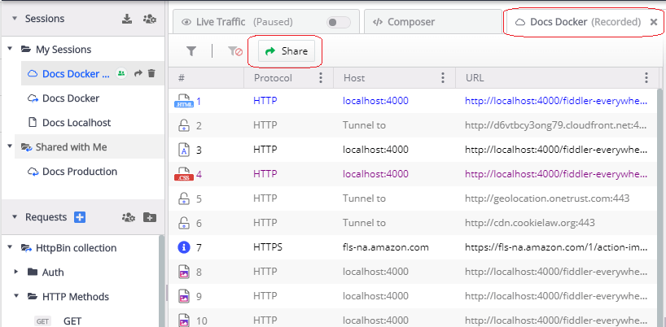
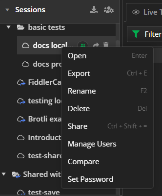
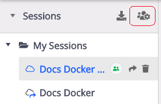

# Sessions Section

The **Sessions** list in Fiddler Everywhere provides the option to save, modify, inspect, encrypt, and share previously captured traffic. The section is part of a collapsible panel (in the **Live Traffic** pane) that you can hide/show to optimize your working space. 

To save sessions to the **Sessions** list, use the [**Save**](#save) and [**Share**](#share) options of the **Live Traffic** list.  All saved entries are automatically sorted in alphabetical order.

## Working with Saved Sessions

You can select, inspect, modify, and share with collaborators previously saved sessions. The saved session entries can be saved locally or in the cloud. Sharing a session with a collaborator is automatically done when you upload the saved session entry to the cloud.

You can apply the following actions to a saved session entry:

- Use single-click to select a saved session entry from the **Sessions** list.
- Use right-click to load the [context menu](#sessions-context-menu) of a selected session entry. The context menu provides multiple options for managing, exporting, and modifying the saved session entry.
- Set a password to encrypt and protect your session. The context menu provides options for setting, changing, and removing passwords for the saved session entry.
- Use double-click to open a saved session entry from the **Sessions** list in a new tab. For encrypted sessions, only users with knowledge of the password can open the session entry.
- Use the UI buttons next to a saved session entry to [**Manage Users**](#manage-users) (cloud session entries only), [**Share**](#sharing-sessions), and [**Delete**](#delete) saved session entries.
- Use the UI buttons at the very top to [**Import**](#import-sessions) sessions archives or to access previously [**Shared Sessions**](#shared-sessions-list) entries.

## Sharing Sessions

To share captured traffic with other collaborators, first, save the session in the cloud. Note that sessions held locally will be transferred to the cloud if you use the share functionalities. For encrypted sessions, only users with knowledge of the password can open the session entry.

Fiddler Everywhere provides UI solutions for sharing and collaboration.

### Sharing Selected Sessions

To share a selected session:

1. Select a saved session entry from the **Sessions** list.
1. Click the **Share** button to the right of the entry name.
1. When the **Share Sessions** prompt window appears, enter a valid email (mandatory) and notes (optional). Click **Share**.

### Sharing Saved Session

To share a saved session:

1. Double-click a saved session entry from the **Sessions** list.
1. The session entry opens in a new tab. Click the **Share** button from the toolbar.
    
1. The **Share Sessions** prompt window appears. Enter a valid email (mandatory) and notes (optional). Click **Share**.

## Managing Users

The **Manage Users** option appears only if the session entry is stored in the cloud and shared. Click **Manage Users** to prompt a window to appear that allows you to manage the list of users that have access to the shared session.

## Deleting

The **Delete** button located to the right of the selected entry removes the chosen session entry from the **Sessions** list. The shared session can be recovered from the [**Shared Sessions**](#shared-sessions) list.

## Sessions Context Menu

Each session provides commands that can be accessed through its context menu or keyboard shortcuts.

### Opening

The **Open** option will load the selected session in the **Live Traffic** list; It can be accessed with the keyboard by pressing `Cmd`+`Enter` (on Mac) or `Enter` (on Windows).

### Exporting

The **Export** option prompts the **Export** windows. The session can be exported to various file formats such as SAZ (Fiddler Archive), HTTPArchive, WCATScript, cURL Script, RAW, and more; It can be accessed with the keyboard by pressing `Cmd`+`E` (on Mac), or `Ctrl`+`E` (on Windows).

### Renaming

The **Rename** option allows you to rename the selected session. Available only to the session owner; It can be accessed with the keyboard by pressing `F2` (on Mac) or `F2` (on Windows).

### Deleting

The **Delete** option removes the session from the **Sessions** list; It can be accessed with the keyboard by pressing `Cmd`+`Back` (on Mac) or `Del` (on Windows).

### Sharing

The **Share** option prompts a window to appear that allows you to add the emails of the users with whom you want to share the session. The sharing option is available only to the session owner; It can be accessed with the keyboard by pressing `Cmd`+`Shift`+`=` (on Mac) or `Ctrl`+`Shift`+`=` (on Windows).

### Managing Users

The **Manage Users** option allows you to manage the users with which the session is being shared. The feature is available only for session entries that are [saved in the cloud](#saving-in-the-cloud) and is active only for the session owner.

 - Manage users icon.

### Comparing 

The **Compare** option allows you to select and inspect two saved sessions through the **Compare Sessions (BETA)** section. [Learn more on how to compare saved sessions here...](#comparing-saved-sessions)

### Saving in The Cloud

The **Save in the Cloud** option allows you to manage the users with which the session is being shared. The feature is available only for session entries that are locally stored and are active only for the session owner.

### Encrypting 

The **Set Password** option allows you to enable encryption and set a password for the selected session entry. Only users with the knowledge of the password will be able to open the password-protected session. Password-protected sessions are listed in the **Session** list with a lock icon. For entries that are already password-protected, the context menu provides the options **Change Password** and **Remove Password**.

 - Password-protected session icon.

## Importing Sessions

**Import Session** provides an option to load sessions that are saved in various formats such as `*.saz` (Fiddler Archive), `*.har` (HTTPrchive), `*.tstest` (TestStudio LoadTest), `*.cap` (Packet Capture), `*.xml` (IE F12 NetXML).

## Shared Sessions List

The **Shared Session** button loads a window with the account history of previously shared session entries. Deleted session entries can be restored using the **Download** option.

