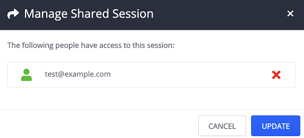
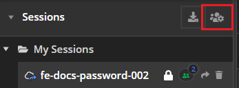

# Sessions List

The Fiddler Everywhere provides the option to save. modify, inspect and share previosly captured traffic. Use the **Live Traffic** list's [**Save**](#save) and [**Share**](#share) options to save sessions to the **Sessions** list.  

## Working with Saved Sessions

Previously saved sessions can be selected, inspected, modified, and shared with collaborators. The saved session entries can be saved locally or in the cloud. Sharing a session with a collaborator is automatically uploading the saved session entry to the cloud. 

A list of some simple actions that can be applied on saved session entry:

- **Single-click** the saved session entry from the **Sessions** list to select it.

- **Right-click** a selected session entry to load the [**context menu**](#sessions-context-menu). The context menu provides multiple options for managing, exporting, and modifying the saved session entry.

- **Double-click** the saved session entry from the **Sessions** list to open it in a new tab.

- Use the UI buttons next to a saved session entry to [**Manage Users**](#manage-users) (cloud session entries only), [**Share**](#sharing-sessions), and [**Delete**](#delete) saved session entries.

- Use the UI buttons at the very top to [**Import**](#import-sessions) sessions archives or to access previosly [**Shared Sessions**](#shared-sessions-list) entries.

## Sharing Sessions

To share captured traffic with other collaborators, you must first save the session in the cloud. Note that sessions held **locally** will be transferred to the cloud if you use the share functionalities. The Fiddler Everywhere provides several UI solutions for sharing and collaboration as follows:

### Share Selected Session

1. Select a saved session entry from the **Sessions** list.

2. Click the **Share** button on the right from the entry's name.

3. The **Share Sessions** prompt window appears. Enter a valid email (mandatory) and notes (optional) and click on the **Share** button.

### Share Loaded Saved Session

1. Double-click a saved Session entry from the **Sessions** list.

2. The session entry opens in a new tab. Click the **Share** button from the toolbar.

    

3. The **Share Sessions** prompt window appears. Enter a valid email (mandatory) and notes (optional) and click the **Share** button.

## Manage Users

The UI option appears only if the session entry is stored in the cloud and shared. Click the **Manage Users** to prompt a window that allows you to manage the list of users that have access to the shared session.

 

## Delete

The **Delete** button (to the right of the selected entry) removes the chosen session entry from the **Sessions** list. The shared session can be recovered from the [**Shared Sessions**](#shared-sessions) list.

## Sessions Context Menu

Each session has several commands that can be accessed through the context menu (or with keyboard shortcuts).

### Open

The option will load the selected session in the **Live Traffic** list. Keyboard shortcut: **Cmd** + **Enter** (Mac), **Enter** (Windows).

### Export

The option prompts the **Export** windows. The session can be exported in various know formats (like SAZ, HTTPArchive, WCATScript, cURL Script, RAW, and others). Keyboard shortcut: **Cmd** + **E** (Mac), **Ctrl** + **E** (Windows).

### Rename

The option allows you to rename the selected session. Available only for the session owner. Keyboard shortcut: **F2** (Mac), **F2** (Windows).

### Share

The option prompts a window where you can add user emails that you want to share the session with. Available only for the session owner. Keyboard shortcut: **Cmd** + **Shift** + **=** (Mac), **Ctrl** + **Shift** + **=** (Windows).

### Delete

The option removes the session from the **Sessions** list. Keyboard shortcut: **Cmd** + **Back** (Mac), **Del** (Windows).

### Manage Users

The option allows you to manage the users with which the session is being shared. Active only for the session owner. 

>important The option is available only for session entries **stored in the cloud**.

### Save In The Cloud

The option allows you to manage the users with which the session is being shared. Active only for the session owner. 

>important The option is available only for session entries that are **locally stored**.

## Import Sessions

The **Import Session** option provides option to load sessions saved in various known formats such as _*.saz_ (Fiddler Archive), _*.har_ (HTTPrchive), _*.tstest_ (TestStudio LoadTest), _*.cap_ (Packet Capture), _*.xml_ (IE F12 NetXML).

## Shared Sessions List

The **Shared Session** button loads a window with the account history of previously shared session entries. Deleted session entries can be restored from here while using the **Download** option.

