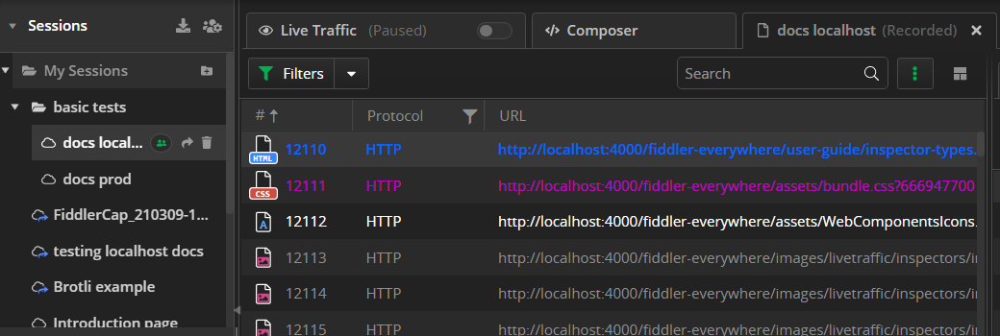
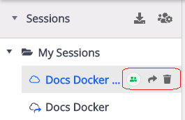
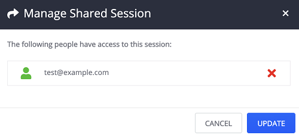
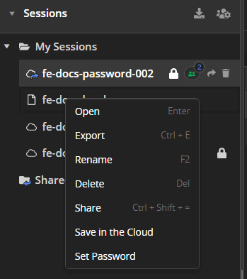

## Sessions

The Fiddler Everywhere client provides the opportunity to save and share the captured traffic (a.k.a. __snapshots__ of sessions). Use the __Live Traffic__ list's [__Save__](#save) and [__Share__](#share) options to add snapshots to the __Sessions__ list. The saved snapshots are available for later usage and sharing in the __Sessions__ list. 

## Sessions Menu

Once a snapshot (of sessions) is saved (or saved & shared) it will be appended to the __Sessions__ list. Each snapshot comes with quick menu options.

- __Manage Users__ option appears only if the snapshot is already shared. Click on the __Manage Users__ to prompt a windows that allows you to manage the list of users that have access to the shared snapshot.

 
- __Share__ option prompts a window where you could add user emails that you want to share the snapshot with. Available only for the snapshot owner.

- __Delete__ option removes the snapshot from the __Sessions__ list. Shared snapshot can be recovered from the __Notifications__ drop-down menu.

## Sessions Context Menu

Each snapshot has several commands that can be accessed via the context menu (or with keyboard shortcuts).

- __Open__ option will load the selected snapshot in the __Live Traffic__ list. Keyboard shortcut: __Cmd__ + __Enter__ (Mac), __Enter__ (Windows).

- __Export__ option promts the __Export__ windows. The snapshot can be exported in SAZ format which can be encrypted (optional). Keyboard shortcut: __Cmd__ + __E__ (Mac), __Ctrl__ + __E__ (Windows).

- __Rename__ option allows you to rename the selected snapshot. Available only for the snapshot owner. Keyboard shortcut: __F2__ (Mac), __F2__ (Windows).

- __Share__ option promts a window where you could add user emails that you want to share the snapshot with. Available only for the snapshot owner. Keyboard shortcut: __Cmd__ + __Shift__ + __=__ (Mac), __Ctrl__ + __Shift__ + __=__ (Windows).

- __Delete__ option removes the snapshot from the __Sessions__ list. Keyboard shortcut: __Cmd__ + __Back__ (Mac), __Del__ (Windows).

- __Manage Users__ option allows you to manage the users with which the snapshot is being shared. Active only for the snapshot owner.