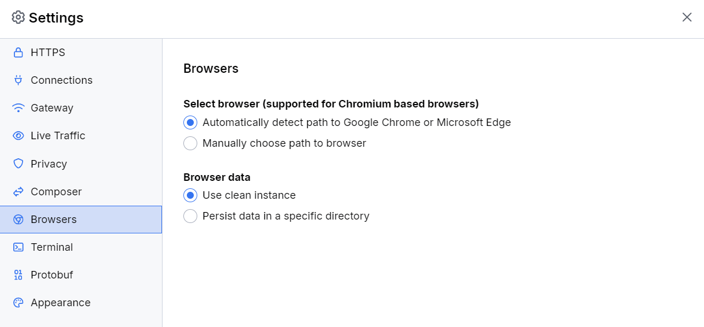

# Browsers Menu

The **Select Browser** sub-menu provides an option for changing the default Fiddler's browser from Google Chrome to other third-party Chromium browsers.

- The **Automatically detect path to Google Chrome** option finds and uses the Google Chrome for the [**independent browser capturing mode**](slug://capture-traffic-get-started#independent-browser-capturing).

- The **Path to Browser** option allows you to change the default browser by setting a path to a different Chromium browser. Fiddler Everywhere supports most Chromium-based browsers (like Edge, Brave, Vivaldi, etc.).

The **Browser Data** sub-menu provides an option for choosing whether the [independent browser capturing mode](slug://browsers-settings-submenu) should always use a clean instance or an instance that persists the input data.

- The **Use clean instance** option instructs Fiddler to always use a new clean instance for the [**independent browser capturing mode**](slug://capture-traffic-get-started#independent-browser-capturing). No data persists when reusing the capturing mode.

- The **Persist data in a specific directory** option allows you to set a custom directory to persist input data and settings for the [**independent browser capturing mode**](slug://capture-traffic-get-started#independent-browser-capturing). 

The following figure displays the default settings of the **Browsers** menu.

* [Learn more about the Fiddler's browser instance here...](slug://capture-browser-traffic)
* [Learn more about other capturing modes in Fiddler here...](slug://capture-traffic-get-started)
