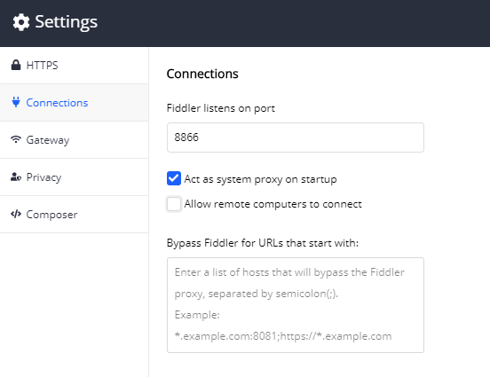
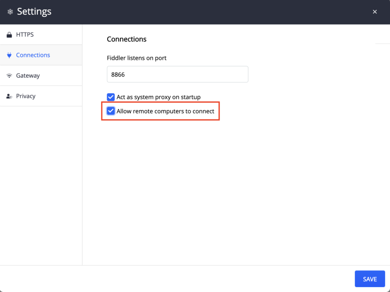

# Connections submenu

The __Connections__ menu exposes some finer control over proxy settings and remote connection. 

- __Fiddler listens on port:__ textbox with default port set to 8866.
- __Act as a system proxy on startup__ checkbox (checked by default).
- __Allow remote computers to connect__ checkbox.

## Setting Proxy Port

__Fiddler listens on port:__ textbox controls which port Fiddler Everywhere uses to listen for web traffic. The default port is 8866

## Act as a System Proxy on Startup

The __Act as a system proxy on startup__ controls whether or not Fiddler Everywhere registers as the system proxy during OS startup. Some browsers and many applications use the system proxy by default and re notified when it changes. 

## Allow Remote Computers to Connect

Fiddler Everywhere allows you to capture traffic from remote devices. This article lists the steps you need to perform to achieve this.

1. Start Fiddler on the device that will capture the traffic.
2. Go to __Settings > Connections.__
3. Ensure that __Allow remote computers to connect__ checkbox is checked.

4. Click the __Save Changes__ button to save the changes.

__Fiddler is now ready to capture traffic from remote devices.__