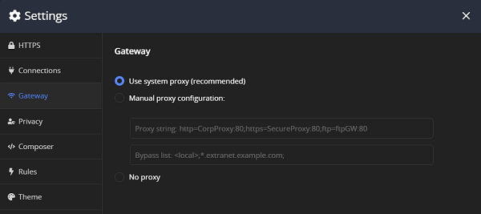

# Gateway Menu

The __Gateway__ sub-menu provides options for configuring the way Fiddler Everywhere efficiently accesses the network.

By default, Fiddler Everywhere "chains" to the default proxy of the system. The **Gateway** settings allow you to override that behavior.

* (Recommended) **Use system proxy**&mdash;The default selection. Fiddler uses the OS system proxy. Some browsers and many applications use the system proxy by default and are notified when it changes.
* __Manual proxy configuration__&mdash;Specifies the upstream proxy string (first textbox) and proxy bypass list (second textbox).
* __Proxy string__&mdash;To manually set the gateway proxy, enter the proxy string.

    * You can enter the proxy configuration string directly.
     ```
     proxyserver:8080
     ```

    * You can enter the proxy in the protocol-specific form.
     ```
     http=httpproxy:8080;https=httpsproxy:8080
     ```

* __Bypass list__&mdash;The proxy bypass list supports the following values:

    - Wildcards. For example, `*.extranet.example.com;`.
    - The `<local>` special token, which means any host name that does not contain a period.
    - The `<-loopback>` special token, which removes the default bypass for `127.0.0.1` and `localhost` host names.

    The following example demonstrates how to list multiple bypass entries separated by a semicolon (`;`).
    ```
    *.extranet.example.com;<local>;<-loopback>;
    ```

* __No proxy__&mdash;Sends all traffic directly to the root server.

The following figure displays an example for a proxy configuration. 


