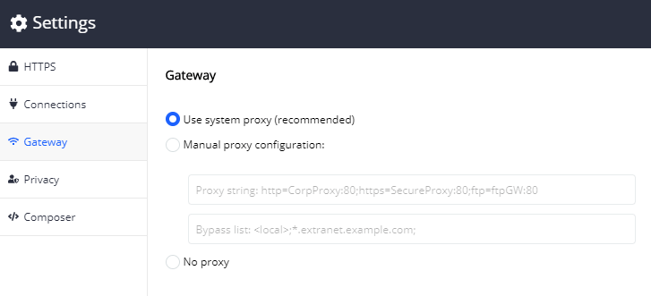
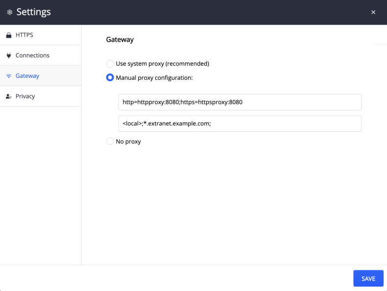

## Gateway

The __Gateway__ submenu provide options to easily configure how Fiddler Everywhere accesses the network. By default, Fiddler Everywhere "chains" to the system's default proxy. These settings allows you to overwrite that behavior.

There are three select options in the submenu:
- __Use system proxy (recommended)__ (default value)
- __Manual proxy configuration__
- __No proxy__

## Use system proxy

- __Use system proxy (recommended)__ is the default selection. Fiddler uses the OS system proxy. Some browsers and many applications use the system proxy by default and re notified when it changes. 



## Manual proxy configuration

Select __Manual proxy configuration__  to specify the upstream proxy string (first textbox) and proxy bypass list (second textbox). 


- Proxy configuration string

The proxy configuration string could be directly set the gateway proxy:
```
proxyserver:8080
```

or the protocol-specific form
```
http=httpproxy:8080;https=httpsproxy:8080
```

- Bypass list

The proxy bypass list supports wildcards and the special tokens `<local>` (meaning any hostname which does not contain a period) and `<-loopback>` which removes the default bypass for `127.0.0.1` and `localhost` host-names.

```
<local>;*.extranet.example.com;
```



## No proxy

Select __No proxy__ if you want to send all traffic directly to the origin server.