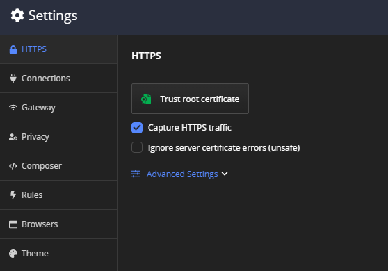

## HTTPS Settings Menu

After the initial startup, the Fiddler Everywhere application could only capture non-secure traffic (HTTP) while SSL traffic is not captured. To enable capturing and decrypting HTTPS traffic, you will need to explicitly install a root trust certificate via the __HTTPS__ sub-menu in __Settings__.

## Trust Root Certificate

The button installs and trusts the Fiddler root certificate (macOS and Windows only).

## Capture HTTPS traffic

The option defines if Fiddler Everywhere should capture HTTPS traffic or skip it. By default, this option is disabled. To enable the HTTPS traffic capturing, first you need to confirm whether the root certificate is trusted. If it is trusted you can simply enable the capture option.

## Export Root Certificate to Desktop and Trust Certificate

Expand __Advanced Settings__ drop-down to show the __Export Root Certificate to Desktop and Trust Certificate__ button. Click the button to export Fiddler the root certificate to the Desktop folder for manual import and trusting of the certificate.

## Additional Resources

* [How to install Fiddler root certificate on Windows]()
* [How to install Fiddler root certificate on Mac OS]()
* [How to install Fiddler root certificate in Firefox on Linux]()
