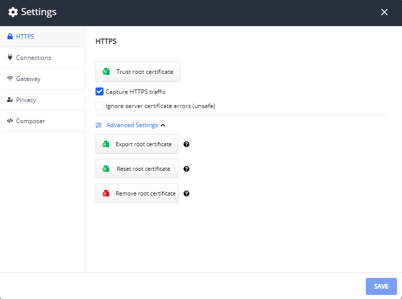

# HTTPS Menu

After the initial startup, the Fiddler Everywhere application could only capture non-secure traffic (HTTP) while SSL traffic is not captured. To enable capturing and decrypting HTTPS traffic, you will need to explicitly install a root trust certificate via the __HTTPS__ sub-menu in __Settings__.

## Trust root certificate

The **Trust root certificate** button installs and trusts the Fiddler root certificate. The option is available on macOS and Windows - on Linux OS you will have to manually export and trust the root certificate.

## Capture HTTPS traffic

The **Capture HTTPS traffic** option defines if Fiddler Everywhere should capture HTTPS traffic or skip it. By default, this option is disabled. First, you need to confirm whether the root certificate is trusted to enable the HTTPS traffic capturing. If it is trusted, you can enable the capture option.

## Ignore server certificate Errors (unsafe)

The **Ignore server certificate errors** controls whether Fiddler will warn you if an HTTPS server has presented a certificate that did not validate. You should not check this box when surfing the Internet due to the spoofing security threat. 

>tip A typical case example would be certificate validation error on macOS while trying to access *.icloud.com domains. Use the option to ignore the validation error and continue the debugging process.

## Advanced Settings

The **Advanced Settings** drop-down provides several options to operate with the root Fiddler certificate. Use the buttons to trigger actions as described below.

### Export root certificate

Expand __Advanced Settings__ drop-down to show the __Export Root Certificate__ button. Click the button to export Fiddler the root certificate to the _Desktop_ folder for manual import and trusting of the Fiddler Everywhere certificate. The exported file will be named **FiddlerRootCertificate.crt**

>tip Some operating systems might not have a folder named _Desktop_. In such cases, you will need to create this folder to export the certificate manually successfully.

### Reset root certificate

Expand __Advanced Settings__ drop-down to show the __Reset root certificate__ button. The action will remove the currently trusted root certificate, generates a new one, and trust it. Several OS prompts will be shown that you will have to accept.

### Remove root certificate

Expand __Advanced Settings__ drop-down to show the __Remove Root Certificate__ button. The action will remove the currently trusted root certificate from the OS certificate store. As a result, this will disable the capturing of HTTPS traffic.

## Additional Resources

* [How to install Fiddler root certificate on Windows]()
* [How to install Fiddler root certificate on Mac OS]()
* [How to install Fiddler root certificate in Firefox on Linux]()
