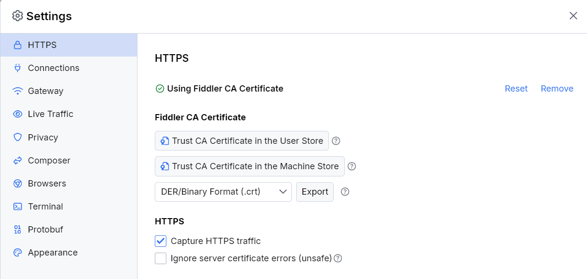

# HTTPS Settings

After initial startup, Fiddler Everywhere captures only non-secure HTTP traffic by default.

To capture and decrypt HTTPS traffic, you must install and trust the Fiddler root CA (Certificate Authority) via the **HTTPS** sub-menu under **Settings**.

## Certificate Trust Options

- **Trust CA Certificate in the User Store**: Installs and trusts the Fiddler root CA in the user store of your OS certificate manager. Available on [macOS](slug://first_steps_macos#start-system-capturing) and [Windows](slug://first_steps_windows#start-system-capturing). On Linux, [export and trust the Fiddler CA certificate manually](slug://first_steps_linux#start-system-capturing). After installation, you can [enable HTTPS traffic capturing](#capture-https-traffic).

- **Trust CA Certificate in the Machine Store**: Installs and trusts the Fiddler root CA in the machine store (all users) of the OS certificate manager. Available on Windows only and requires administrative privileges.

- **Export**: Exports the Fiddler CA certificate in your chosen format: DER/Binary (.crt), PEM/BinASCII (.pem), or PKCS 12 (.p12).

- **Reset**: Removes the current CA, generates a new one, and trusts it. Use if you suspect compromise or encounter certificate issues.

- **Remove**: Removes the trusted CA from the OS certificate store. HTTPS traffic capturing will be disabled until a new CA is installed.

## HTTPS Traffic Options

- **Capture HTTPS traffic**: Enables or disables HTTPS traffic capturing. Disabled by default. You must trust the Fiddler root certificate first.

- **Ignore server certificate errors**: Controls whether Fiddler warns you if an HTTPS server presents an invalid certificate. 
  - **Warning:** Do not enable this when browsing the Internet, as it may expose you to [spoofing attacks](https://en.wikipedia.org/wiki/Spoofing_attack).
  - **Checkbox active, ignore list blank**: Ignores all server certificate errors.
  - **Checkbox active, ignore list populated**: Ignores errors only for listed endpoints (new connections only).
  - **Checkbox inactive**: Fiddler will show a warning page for certificate errors, with a quick link to add the endpoint to the ignore list.

## Default HTTPS Settings

The following figure displays the default settings of the **HTTPS** menu:

## Inline Notifications

If the Fiddler root CA is not yet trusted, an inline notification will warn you that [system HTTPS capture](slug://capture-traffic-get-started#system-capturing) is disabled. This notification hides if you use [independent browser capturing](slug://capture-traffic-get-started#independent-browser-capturing) and reappears when you close the independent browser instance.

## Troubleshooting & Best Practices

- Always install the CA certificate only from the official Fiddler Everywhere application.
- Use the User Store for personal development; use the Machine Store only if multiple users need HTTPS capture.
- Remove the CA certificate when you no longer need HTTPS capturing for security.
- If HTTPS capture does not work, verify the CA is trusted and "Capture HTTPS traffic" is enabled.
- For certificate errors on specific sites, add the domain to the ignore list (for development only).
- On Linux, always follow the manual export and trust instructions for your distribution.