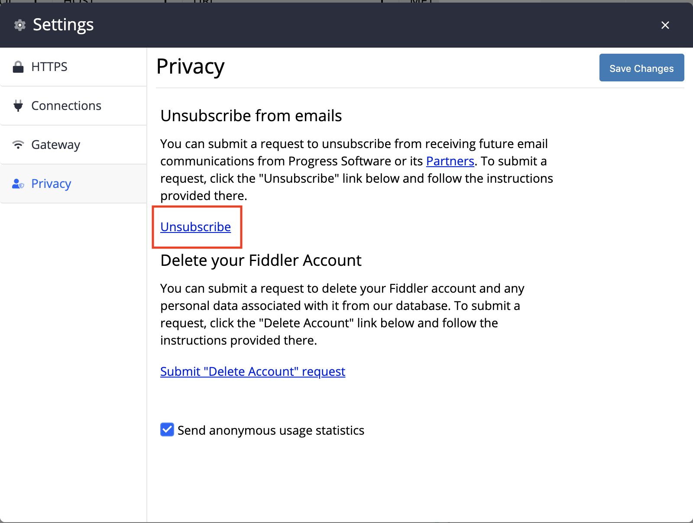
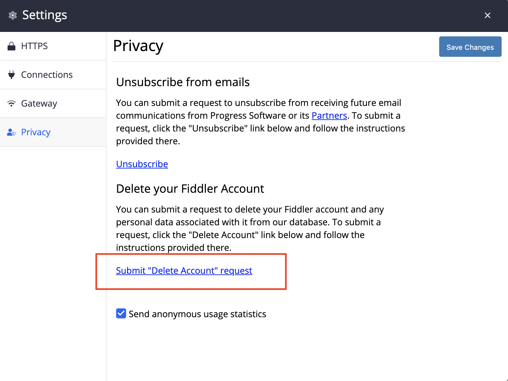

# Privacy submenu

The __Privacy__ submenu provide options to opt-out of receiving emails from Progress and its partners and the option to delete your Fiddler Everywhere associated account.

There are two options in the submenu:

- __Unsubscribe from emails__
- __Delete your Fiddler Account__
- __Submit anonymous usage statistics__ checkbox

## Unsubscribe from emails

To sumbit a request to unsubscribe from receiving future emails, click on the __Unsibscribe__ link. You will be redirected to a unsubscribe page where you should follow the given instructions.

## Delete your Fiddler Account

To sumbit a request to click on the __Submut "Delete Account" request__ link. You will be reditected to a page where you should follow the given instructions.

## Submit anonymous usage statistics

Checke/uncheck the option depending on whether you want to send anonymous usage statistic. Once the choice is made click on __Save Changes__ to apply then change.