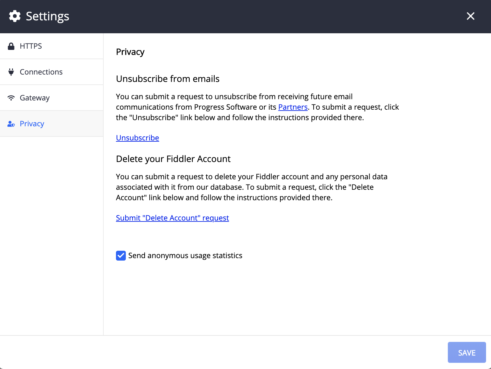

## Privacy

The __Privacy__ submenu contains options to opt-out of receiving emails from Progress and its partners and the opportunity to request the deletion of your Fiddler Everywhere associated account.

There are several options in the submenu:

- __Unsubscribe from emails__
- __Delete your Fiddler Account__
- __Send anonymous usage statistics__ checkbox

## Unsubscribe from emails

To submit a request to unsubscribe from receiving future emails, click on the __Unsibscribe__ link. You will be redirected to a unsubscribe page where you should follow the given instructions.

### Delete your Fiddler Account

To submit a request to click on the __Submut "Delete Account" request__ link. You will be redirected to a page where you should follow the given instructions.

## Send anonymous usage statistics

Check/uncheck the __Send anonymous usage statistics__ option depending on whether you want to send anonymous usage statistics. Once the choice is made, click on __Save Changes__ to apply then change.