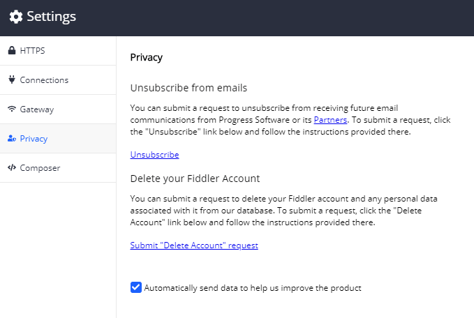

## Privacy Menu

The __Privacy__ sub-menu contains options to opt-out of receiving emails from Progress and its partners and the opportunity to request the deletion of your Fiddler Everywhere associated account.

## Unsubscribe from emails

To submit a request to unsubscribe from receiving future emails, click on the __Unsubscribe__ link. You will be redirected to a unsubscribe page where you should follow the given instructions.

## Delete your Fiddler Account

To submit a request, click on the __Submit "Delete Account" request__ link. You will be redirected to a page where you should follow the given instructions.

## Send anonymous usage statistics

Check/uncheck the __Send anonymous usage statistics__ option depending on whether you want to send anonymous usage statistics. Once the choice is made, click on __Save Changes__ to apply the change.
