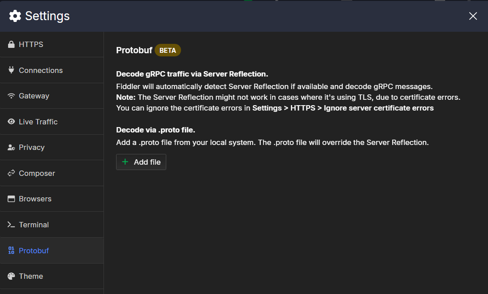

# Protobuf Menu

The **Protobuf** menu provides an option to supply Fiddler with `.proto` files for gRPC decoding.

The available options are:

- **Decode gRPC traffic via Server Reflection**&mdash;This option is always enabled in Fiddler Everywhere but will be used only if the server supports it. Additionally, you must ignore server certificate errors through the **HTTPS explicitly> Ignore server certificate errors** option if a TLS connection is used.
- **Decode via .proto file**&mdash;Enables you to supply existing Protobuf schema files with `.proto` extension. Fiddler will try to use the provided files to decode the received gRPC messages automatically.

