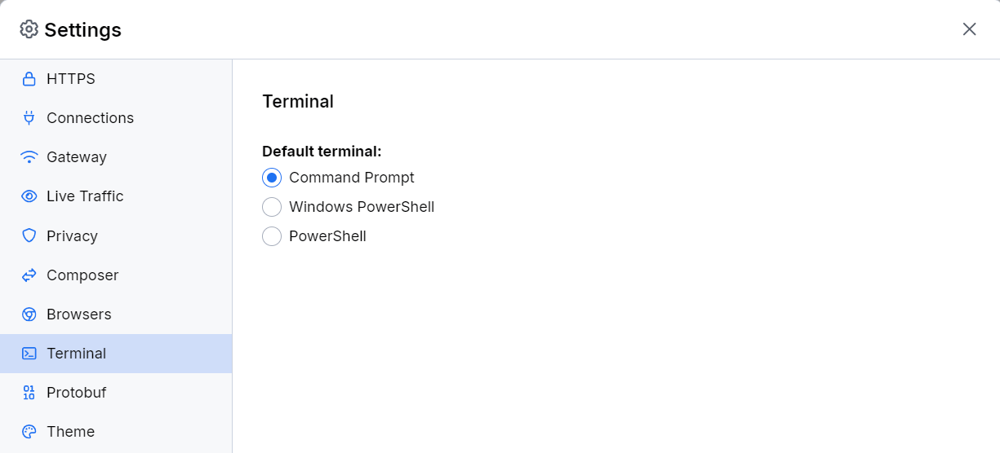

# Terminal Menu

The **Terminal** menu allows you to set the specific terminal to be used as a preconfigured instance with the [terminal capturing mode]().

The available options are as follows:

- **Command Prompt**&mdash;Available only on Windows.
- **Windows PowerShell**&mdash;Available only on Windows. Specifies the Windows PowerShell built on .NET Framework 4.5 and older versions.
- **PowerShell**&mdash;Available only on Windows. Specifies the PowerShell built on .NET Core or the new .NET.
- **Terminal application**&mdash;Available on macOS and Linux. This option will use the default shell environment, for example, **bash**, **zsh**, or **sh**.

The Fiddler's terminal instance automatically proxies all HTTPS requests made by **curl** or **Node.js** libraries (like **https**, **request**, etc.) and all applications which respect the `http_proxy` and `https_proxy` environment variables.

