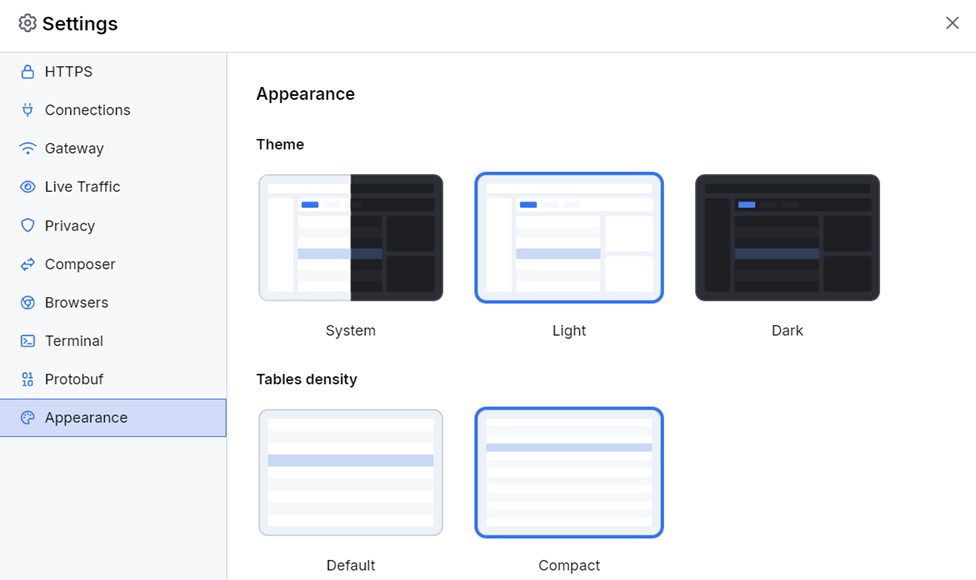

# Appearance Settings

The **Appearance** menu provides theme and UI customization options to personalize your Fiddler Everywhere experience.

## Theme Selection

By default, Fiddler Everywhere uses the **System** theme, which automatically adapts to your operating system's appearance settings. To change the theme:

1. Select your preferred theme from the dropdown menu
2. Click **Save** to apply the changes

### Available Themes

- **System**: Automatically matches your operating system's theme (light or dark)
- **Light**: Uses a bright color scheme with dark text on light backgrounds
- **Dark**: Features a dark color scheme with light text on dark backgrounds

> **Tip:** The dark theme can reduce eye strain during extended debugging sessions, especially in low-light environments.

## Table Density

The **Table Density** setting controls the spacing and compactness of information displayed in:
- Live traffic grid sessions
- Inspector panel content
- Other tabular data throughout the application

### Density Options

- **Default**: Standard spacing with comfortable row heights for easy reading and interaction
- **Compact**: Reduced spacing and smaller row heights to display more information on screen

Choose the option that best suits your screen size, resolution, and personal preference. Compact mode is particularly useful when working with large datasets or on smaller screens where you need to see more entries at once.

## Best Practices

- **System theme** is recommended for users who switch between light and dark OS themes
- **Dark theme** is ideal for extended debugging sessions or low-light environments  
- **Light theme** works well in bright environments and for sharing screenshots
- **Default density** provides better readability and is recommended for most users
- **Compact density** is useful when you need to view more traffic entries simultaneously or work on smaller screens
- Adjust settings based on your screen resolution and the amount of information you need to view simultaneously
