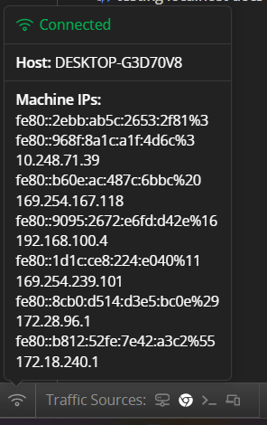
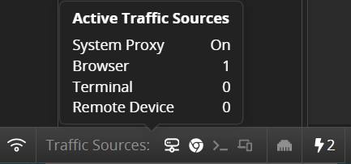
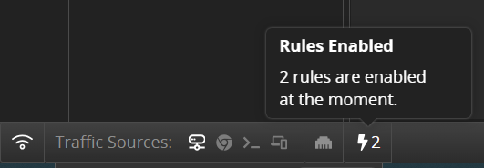
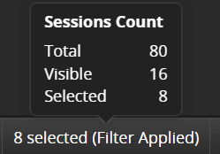

# Status Bar

The **Status Bar** section is located at the bottom-left corner of Fiddler Everywhere. It contains information about the state of the connection, the network configuration, the traffic sources, and session count info.

The section pops up on mouse interaction and lists the following information:

- **Connection Status***&mdash;Shows the state of the network that provides the Internet connectivity.

- **Host**&mdash;Outputs the machine's hostname that Fiddler Everywhere runs on.

- **Domain**&mdash;Outputs the machine's domain name that Fiddler Everywhere runs on.

- **Machine IPs**&mdash;A list of the IPv6 and IPv4 addresses of the active network adapters on the machine that hosts Fiddler Everywhere.

    

- **Traffic Sources**&mdash;A list of all available Fiddler Everywhere traffic sources that highlights the active ones.

    

- **Rules Count**&mdash;A popup that shows counters of all enabled rules.

    

- **Sessions Count**&mdash;A popup that shows live counters of **total** captured, **visible** (counts only the non-filtered) and **selected** sessions.

    
